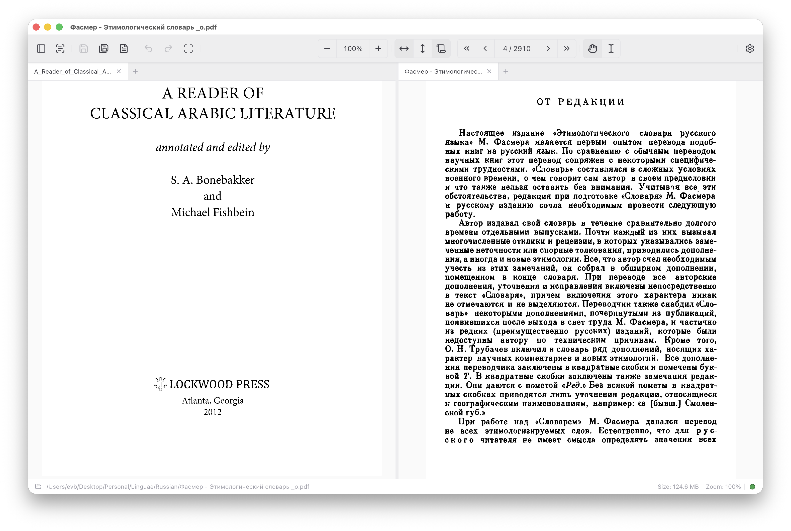

# EVB Viewer

A cross-platform desktop viewer for **PDF** and **DjVu** documents with built-in OCR, annotations, and a multi-tab workspace.

Built with Electron, Nuxt 4, and Vue 3.



## Features

**Document Support**
- PDF viewing and manipulation powered by PDF.js
- DjVu viewing with automatic PDF conversion (via DjVulibre)
- Image-to-PDF conversion (PNG, JPG, TIFF, BMP, WebP)

**OCR**
- Tesseract-based OCR with high-accuracy `tessdata_best` models
- 10 languages: English, French, German, Russian, Greek (modern & ancient), Hebrew, Turkish, Kurdish (Kurmanji), Syriac
- Parallel page processing with configurable concurrency
- Generates searchable PDF output from scanned documents

**Annotations**
- Markup: highlight, underline, strikethrough, squiggly
- Shapes: rectangle, circle, line, arrow
- Freehand drawing, text boxes, and stamps
- Comment threads with a dedicated panel
- Full annotation serialization back to PDF

**Page Operations**
- Delete, extract, reorder, and rotate pages
- Region capture (snip tool)
- Batch operations on selected pages
- Merge multiple PDFs

**Workspace**
- Multi-tab interface with drag-to-reorder
- Split-panel layout (side-by-side document viewing)
- Cross-window tab transfer
- Persistent workspace state across sessions
- Thumbnail sidebar, outline/bookmark navigation

**Export**
- PDF (with annotations and searchable text)
- Images: PNG, JPG, multi-page TIFF
- DOCX (Word) with extracted text and annotations

**Other**
- Full-text search with highlighted results
- Dark and light themes
- Undo/redo for annotations and document edits
- 8 UI languages: English, Russian, French, German, Spanish, Italian, Portuguese, Dutch
- Keyboard shortcuts throughout

## Platforms

| OS | Architectures | Installer |
|----|---------------|-----------|
| macOS | x64 (Intel), arm64 (Apple Silicon) | DMG, ZIP |
| Windows | x64, arm64 | NSIS installer |
| Linux | x64, arm64 | AppImage, DEB |

Native binaries (Tesseract, Poppler, QPDF, DjVulibre) are bundled per platform and architecture — no system dependencies required.

## Development

### Prerequisites

- [Node.js](https://nodejs.org/) 20+
- [pnpm](https://pnpm.io/) 9+

### Setup

```bash
pnpm install
```

### Commands

```bash
# Development — runs Nuxt dev server + Electron
pnpm dev

# Build Nuxt + Electron for production
pnpm build

# Run production build locally
pnpm start

# Package distributable
pnpm dist            # All platforms
pnpm dist:mac        # macOS only
pnpm dist:win        # Windows only
pnpm dist:linux      # Linux only

# Quality checks
pnpm lint            # ESLint + Stylelint (with auto-fix)
pnpm typecheck       # TypeScript (app + Electron)
pnpm test            # Vitest (unit + integration)
pnpm validate        # lint + typecheck + build + knip (dead code)
```

### OCR Tuning

The OCR pipeline spawns parallel Tesseract processes. Two environment variables control resource usage:

| Variable | Default | Description |
|----------|---------|-------------|
| `OCR_CONCURRENCY` | `min(cpuCount, 8)` | Max pages processed in parallel |
| `OCR_TESSERACT_THREADS` | `floor(cpuCount / OCR_CONCURRENCY)` | Thread limit per Tesseract process |

## Architecture

```
┌──────────────────────────────────────────────────────────────┐
│                   ELECTRON MAIN PROCESS                      │
│                                                              │
│  Window management, IPC handlers, native tool orchestration  │
│  (OCR, DjVu conversion, page ops, file I/O, search)         │
└──────────────────────┬───────────────────────────────────────┘
                       │ IPC (contextBridge)
                       ▼
┌──────────────────────────────────────────────────────────────┐
│                   NUXT SPA (ssr: false)                      │
│                                                              │
│  Vue 3 Composition API · Nuxt UI · Tailwind CSS · PDF.js    │
│  Served on localhost:3235 in dev, bundled Nitro server in    │
│  production                                                  │
└──────────────────────────────────────────────────────────────┘
```

### Project Layout

```
app/                  Nuxt frontend
  components/         Vue components (PDF viewer, toolbar, OCR, annotations)
  composables/        Vue composition functions
  locales/            i18n translation files (8 languages)
  assets/css/         Design tokens and global styles
  types/              TypeScript interfaces
electron/             Electron main process
  ocr/                Tesseract OCR pipeline and workers
  djvu/               DjVu conversion and viewing
  page-ops/           Page manipulation (QPDF)
  ipc/                IPC handler modules
resources/            Bundled native binaries per platform/arch
  tesseract/          Tesseract binaries + tessdata_best models
  poppler/            PDF rendering utilities
  qpdf/               PDF page manipulation
  djvulibre/          DjVu tools
tests/
  unit/               Vitest unit tests
  integration/        Playwright integration tests
scripts/              Build, packaging, and verification scripts
```

## Tech Stack

| Layer | Technology |
|-------|------------|
| Shell | Electron 39 |
| Frontend | Nuxt 4, Vue 3, TypeScript 5 |
| UI | Nuxt UI 4, Tailwind CSS 4, Lucide icons |
| PDF | PDF.js 5 (rendering), pdf-lib (manipulation) |
| OCR | Tesseract (native binary), Poppler (image extraction) |
| DjVu | DjVulibre (native binary) |
| Pages | QPDF (native binary) |
| Build | esbuild, electron-builder |
| Test | Vitest, Playwright |
| Lint | ESLint, Stylelint, Knip |

## License

[MIT](LICENSE) &copy; 2026 Eugene Barsky
