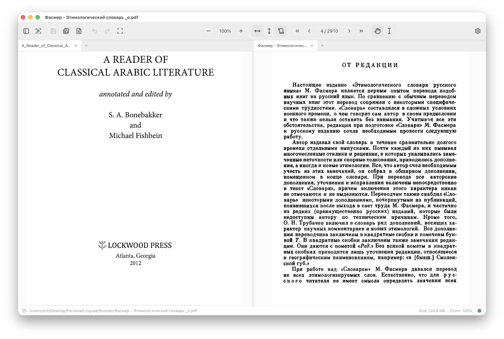

# EVB Viewer

EVB Viewer turns raw scans and DjVu files into clean, searchable, annotatable
PDFs: native scan cleanup, Tesseract OCR in 30 languages, annotation, and
export. It runs offline on macOS, Windows, and Linux, it is free, and the
source is MIT.

The document is also an AI workspace. An optional assistant, off by default,
can operate the open document for you, and the app runs a local MCP server so
Claude Code, Cursor, or any other MCP client can drive it too.

<!-- Replace with docs/media/hero-before-after.png (one scanned page, raw left,
     cleaned and OCR'd right) once that image exists. -->

## Try it without installing

[evb-viewer.com](https://evb-viewer.com) runs the same workspace in a browser
tab. Open a local PDF, DjVu file, or image and you can read it, search it,
annotate it, reorder, rotate, crop and extract pages, and export the result.
The document is opened by the page itself and never uploaded; the page
operations run the same Rust code as the desktop app, compiled to WebAssembly.

The heavy work stays on the desktop. OCR, scan cleanup, the assistant, and jobs
larger than a browser tab's memory need the installed app.

## Install

| Platform | Download |
| --- | --- |
| macOS | [DMG](https://github.com/evb0110/evb-viewer/releases/latest) (Apple Silicon and Intel) |
| Windows | [Installer](https://github.com/evb0110/evb-viewer/releases/latest) (x64 and ARM64) |
| Linux | [AppImage or DEB](https://github.com/evb0110/evb-viewer/releases/latest) (x64 and ARM64) |

Every release ships `SHA256SUMS` and build provenance files.

## What it does

The app is built around one workflow, from a shoebox of scans to a document you
can search.

- **Open** PDF, DjVu, and image batches. Combine loose page images into one PDF.
- **Clean** scanned pages: deskew, despeckle, binarize, crop, and split
  two-page spreads. This runs in a native Rust engine, not a filter chain.
- **OCR** the pages with Tesseract and `tessdata-best` models. English and
  Russian are bundled for offline use; 28 more languages download on demand,
  including Ancient Greek, Hebrew, Arabic, and Syriac.
- **Export** a searchable PDF, or DOCX, PNG, JPG, and multi-page TIFF.
- **Annotate** with free text, ink, highlight, shapes, arrows, notes, and
  placed images. Edit bookmarks, page labels, and page order from the sidebar.
- **Work at scale** across tabs, split panes, and multiple windows, with tab
  transfer between windows.

## The AI assistant and the MCP server

The assistant works on the document you have open. It can rebuild a
book's outline from its printed table of contents, apply page labels from the
printed page numbers, find every mention of a term across a scanned volume, or
report where the OCR text layer is thin.

The assistant is off by default. Nothing leaves your machine until you enable it
and sign in with your own Codex or Claude account, and the app ships no API key
and runs no service of its own. Cleanup, OCR, search, export, and annotation
never use it, so the app is fully usable with the assistant switched off for
good.

The same capabilities are available to outside agents. With external MCP
enabled, the running app exposes a local Model Context Protocol server with
around 28 document tools, so Claude Code, Cursor, or any MCP client can read
pages, search, and drive the viewer. See
[connecting an MCP client](docs/user/mcp-clients.md).

## Why this exists

Cleaning and recognizing a scanned book is a solved problem only if you pay for
ABBYY FineReader or assemble a chain of ScanTailor, OCRmyPDF, and a separate
viewer. Neither path handles DjVu as a first-class input, and neither lets you
fix the result in the same window where you read it. EVB Viewer is for the
people who hit that wall: archivists, librarians, historians, philologists, and
anyone maintaining a personal library of scans.

## Engineering

EVB Viewer is written and maintained by one person. The shell is Electron and
Nuxt, but the work that matters happens in native code and in the process
boundaries around it.

- **Rust sidecars** for scan cleanup (the largest crate, with its own JBIG2
  codec and raster IO), page operations, image combination, and PDF search.
- **PDF.js renders, Rust writes.** The renderer never produces PDF bytes; one
  writer owns serialization, incremental saves, and multi-gigabyte documents.
- **A local MCP server** with a capability registry and two provider adapters:
  the Codex app-server in a sandboxed child process with an isolated home, and
  the Claude Agent SDK. Every request is bound to one window, tab, document,
  and revision, over a random port behind a bearer token.
- **Release engineering**: signed and notarized installers, an auto-update
  canary, build provenance, and a Windows acceptance lane that drives the
  packaged app inside a UTM virtual machine.
- **Opt-in diagnostics.** Crash reporting is consent-gated and off until you
  turn it on.

[ARCHITECTURE.md](ARCHITECTURE.md) is the one-page map.

### How it is built

This repository is developed with a heavily gated AI-assisted workflow. Every
change, whoever or whatever writes it, goes through the same lint, type, unit,
integration, and packaged-app checks before it lands, and a commit that adds or
weakens a check is rejected unless a human asked for it. The commit count is
high for that reason. The rules that workflow runs under are in
[AGENTS.md](AGENTS.md), in the open. The design decisions are mine and are
recorded in the [decision records](docs/architecture/adr) and the
[glossary](docs/architecture/glossary.md) that fixes the vocabulary the code
uses.

## Status

Actively developed. Viewing, editing, annotation, OCR, scan cleanup, export,
and the release pipeline are stable and used daily. The assistant and the
external MCP server are opt-in and still moving. Server-side error reporting
for the hosted browser build is deliberately disabled.

## Docs

- [Formats, runtimes, and languages](docs/user/formats-and-languages.md)
- [Connecting an MCP client](docs/user/mcp-clients.md)
- [Architecture](ARCHITECTURE.md) and [design principles](docs/architecture/design-principles.md)
- [Development and checks](docs/contributing/development.md)
- [Release process](docs/contributing/releasing.md)
- [Contributing](CONTRIBUTING.md) · [Security](SECURITY.md) · [Support](SUPPORT.md) · [Code of Conduct](CODE_OF_CONDUCT.md)
- [Third-party notices](THIRD_PARTY_NOTICES.md)

## License

[MIT](LICENSE) Copyright (c) 2026 Eugene Barsky
