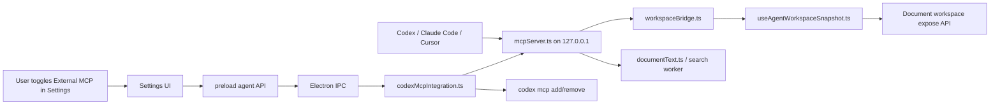
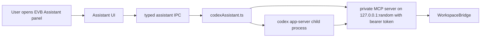

# EVB Viewer MCP Architecture

This document describes the current local MCP architecture for EVB Viewer so future threads can iterate without re-discovering the wiring.

## Current Shape

EVB Viewer exposes a local, desktop-only MCP server from the Electron main process. The server gives agents a live view of the workspace, including panes, tabs, the active document when one is present, page numbers, document readiness, searchable text coverage, PDF search, page text reads, and navigation commands.

There are two agent-facing entry points:

- **Embedded EVB Assistant**: When the user enables the assistant setting and opens the assistant panel, EVB Viewer owns a sandboxed `codex app-server` child process, an isolated `CODEX_HOME`, and a private random-port MCP server protected by a bearer token. This powers the in-app assistant panel, works with empty workspaces as well as open documents, uses the system browser for ChatGPT sign-in, and does not mutate global Codex configuration.
- **External MCP Server**: the advanced Settings switch starts the fixed-port MCP server and registers it in global Codex settings using the Codex CLI. The same HTTP server URL can be configured manually in other MCP clients such as Claude Code or Cursor.

The embedded assistant panel has its own normal app preference, separate from the external MCP switch. The assistant preference defaults off; enabling it makes the sidebar and launcher available, and disabling it hides the UI and shuts down the embedded Codex runtime and private MCP server. It does not start, stop, or register the external MCP server.

When the external switch is enabled, EVB Viewer starts the local MCP server and registers it in global Codex settings using the Codex CLI. When disabled, EVB Viewer removes the Codex MCP entry and shuts the local server down. Other clients use the same local URL while EVB Viewer is running and external MCP is enabled.



The embedded assistant uses the same MCP tool implementation, but through a separate random-port listener:



## File Map

- `electron/features/agent/mcpServer.ts`
  Local HTTP JSON-RPC MCP server, tool/resource/prompt definitions, server identity, port selection, and request dispatch.

- `electron/features/agent/codexMcpIntegration.ts`
  End-user Codex integration: Codex CLI discovery, native permission dialogs, global Codex config mutation, status reporting, and startup sync with app settings.

- `electron/features/agent/codexAssistant.ts`
  Embedded assistant runtime: EVB-managed Codex install/login/status flow, isolated app-server process, assistant chat thread lifecycle, and renderer-safe event streaming.

- `electron/features/agent/codexCli.ts`
  Shared cross-platform Codex discovery, version checks, managed install directory, and official standalone installer execution.

- `electron/features/agent/workspaceBridge.ts`
  Main-to-renderer request bridge for workspace snapshots and UI navigation commands. Uses request ids, sender-window validation, and timeouts.

- `electron/features/agent/documentText.ts`
  Main-process document text operations backed by the existing PDF search worker and search indexes.

- `electron/features/search/public.ts`
  Public feature entrypoint used by the agent feature for search worker path resolution, allowed PDF path resolution, and `SearchWorkerService`.

- `app/modules/workspace-shell/composables/useAgentWorkspaceSnapshot.ts`
  Renderer-side snapshot builder and command handler. It sees panes, tabs, layout, workspace refs, toolbar snapshots, and navigation APIs.

- `packages/contracts/agent.ts`
  Shared agent/MCP contracts for snapshots, commands, readiness, Codex integration status, and update results.

- `packages/contracts/electronApiAgent.ts`
  Platform capability for agent IPC: request subscriptions, response submission, MCP status, MCP toggle, and embedded assistant lifecycle methods.

- `app/components/settings/SettingsAgentPanel.vue`
  Desktop settings panel with separate in-app assistant visibility and external MCP status/setup controls.

- `app/modules/agent-panel/components/AgentAssistantPanel.vue`
  Desktop assistant panel with Codex install/update, ChatGPT sign-in, workspace/document empty states, and chat composer.

- `scripts/evb-mcp-proxy.mjs`
  Compatibility stdio proxy for development/manual MCP clients. It mirrors the MCP descriptors and forwards JSON-RPC to the local HTTP endpoint.

- Tests:
  `tests/unit/electron/agentMcpServer.test.ts`,
  `tests/unit/electron/agentMcpProxy.test.ts`,
  `tests/unit/app/modules/workspace-shell/composables/useAgentWorkspaceSnapshot.test.ts`,
  plus settings tests for persisted agent preferences.

## Server Identity And Ports

The server binds to loopback only:

- Host: `127.0.0.1`
- Packaged app: server name `evb_viewer`, default port `38671`
- Dev app: server name `evb_viewer_dev`, default port `38672`
- Port override: `EVB_MCP_PORT`

The identity is derived in `createLocalMcpServerIdentity()` from Electron `app.isPackaged`, `app.getName()`, `app.getVersion()`, and `app.getPath('userData')`.

The `/health` endpoint returns identity plus available tools, resources, and prompts. MCP JSON-RPC requests are accepted by `POST` to the same HTTP server.

## Settings, Assistant Visibility, And Codex Registration

The persisted settings are:

- `assistantPanelEnabled`, defaulting to `false`. This is a normal renderer-managed app preference. It controls whether the embedded assistant sidebar and launcher are available; the main process also refuses to start the assistant runtime while it is disabled.
- `agentMcpEnabled`, defaulting to `false`. This is managed by the Electron Codex MCP flow because toggling it starts/stops the external server and mutates global Codex configuration.

When the user enables MCP:

1. Renderer calls `getPlatformAPI().agent.setMcpIntegrationEnabled(true)`.
2. Preload invokes `agent:setMcpIntegrationEnabled`.
3. Main process calls `setAgentMcpIntegrationEnabled(true, parentWindow)`.
4. The app finds Codex by checking:
   - `CODEX_CLI_PATH`
   - `/Applications/Codex.app/Contents/Resources/codex` on macOS
   - each `PATH` entry
   - common user/system binary locations
   - `command -v codex` in the login shell on non-Windows hosts
5. If Codex is missing, a native dialog offers to open `https://developers.openai.com/codex/app`.
6. If Codex exists, EVB Viewer asks permission before mutating global Codex settings.
7. The local MCP server starts.
8. EVB Viewer runs:
   - `codex mcp remove <server-name>` as a best-effort cleanup
   - `codex mcp add <server-name> --url <server-url>`
9. `agentMcpEnabled` is saved as `true`.

When disabling, EVB Viewer asks permission, removes the Codex MCP entry, shuts down the local server, and saves `agentMcpEnabled` as `false`.

The current registration target is direct Streamable HTTP in Codex, not stdio:

```toml
[mcp_servers.evb_viewer_dev]
url = "http://127.0.0.1:38672"
```

Manual setup for common external clients uses the same server name and URL:

```bash
codex mcp add evb_viewer_dev --url http://127.0.0.1:38672
claude mcp add --transport http --scope user evb_viewer_dev http://127.0.0.1:38672
```

```json
{
  "mcpServers": {
    "evb_viewer_dev": {
      "url": "http://127.0.0.1:38672"
    }
  }
}
```

Renderer settings saves intentionally preserve `agentMcpEnabled` in `electron/platform-ipc/registerIpcHandlers.ts` so stale renderer settings snapshots cannot clobber a value managed by the Codex mutation flow. `assistantPanelEnabled` is allowed through normal settings saves because it does not mutate external Codex configuration; when it is saved as `false`, the main process shuts down the embedded assistant runtime.

## Startup And Shutdown

After `runInitSequence()` completes, `electron/main.ts` calls `syncAgentMcpServerWithSettings()`.

- If `agentMcpEnabled` is `true`, `startLocalMcpServer()` runs.
- If `false`, `shutdownLocalMcpServer()` is called.

Shutdown cleanup always includes `shutdownLocalMcpServer()` before updates, DjVu, OCR, and working-copy cleanup.

The old environment toggle `EVB_MCP_SERVER=1` is no longer used. `pnpm dev` starts the app normally; the Settings toggle controls whether MCP runs.

## MCP Protocol Surface

The server uses JSON-RPC 2.0 and reports protocol version `2025-11-25`.

Supported methods:

- `initialize`
- `notifications/initialized`
- `tools/list`
- `tools/call`
- `resources/list`
- `resources/templates/list`
- `resources/read`
- `prompts/list`
- `prompts/get`

Batch JSON-RPC requests are supported. Request bodies are capped at 1 MiB. Responses are JSON with `Cache-Control: no-store`. Notifications get `202` when there is no response payload.

Initialize instructions explicitly tell agents to use EVB Viewer MCP tools before inspecting processes, files, windows, debug ports, or the repository when the user asks about EVB Viewer, the workspace, or the open document. A document may not be open, so agents should inspect the workspace before assuming document-specific context.

## Tools

| Tool | Purpose | Mutation |
| --- | --- | --- |
| `evb_list_capabilities` | Discover compact semantic EVB Viewer capabilities by domain, including document, annotation, bookmarks, page labels, OCR, view, file, export, history, and page operations. Use `detail: "full"` only when a full listing is really needed. | Read-only |
| `evb_describe_capability` | Inspect one capability's input schema, risk, policy, availability, and related resources. Prefer this over full capability listings when the id is known. | Read-only |
| `evb_run_action` | Run a semantic capability action, such as navigation, OCR, sidebar actions, or annotation creation. | Depends on capability |
| `evb_read_action` | Run a semantic read-only or preview capability, such as document search, page reads, page-label preview, or bookmark preview. | Read-only |
| `evb_read_resource` | Read EVB resource URIs such as workspace, page text, text status, annotations, notes, TOC/bookmarks, and page labels. | Read-only |
| `evb_job_status` | Read status for a long-running EVB action job if an action returned a job id. OCR progress is exposed through the `ocr.status` capability; current EVB MCP actions otherwise complete inline or expose progress in the app UI. | Read-only |
| `evb_workspace_snapshot` | Full live workspace: summary mode, panes, tabs, active ids, layout tree, document kind, page numbers, readiness, and recent-file list metadata. | Read-only |
| `evb_viewer_open_documents` | Fast answer for "what document is open?" including workspace mode, real open documents, active document, pane/tab mapping, and recent-file list metadata. Empty tabs are not reported as documents. | Read-only |
| `evb_document_readiness` | Preparation hints for all tabs or a selected tab. | Read-only |
| `evb_inspect_document_text` | Warm/reuse the search index and report searchable text coverage plus OCR recommendations. | Read-only |
| `evb_search_document` | Search text in a selected or active open PDF. | Read-only |
| `evb_viewer_search_open_document` | Same search surface with stronger naming for discovery by agents. | Read-only |
| `evb_read_document_pages` | Read extracted text for selected PDF pages from the search index. | Read-only |
| `evb_activate_tab` | Activate an existing tab by id. | UI navigation |
| `evb_go_to_page` | Activate a tab if needed and navigate to a one-based page number. | UI navigation |

Read-only tools set MCP annotations with `readOnlyHint: true`, `destructiveHint: false`, `idempotentHint: true`, `openWorldHint: false`. Navigation tools are non-destructive but not read-only.

`evb_list_capabilities` defaults to compact descriptors so agents can discover ids without loading every JSON schema into context. Call `evb_describe_capability` for the selected id before write, destructive, or long-running actions. Compatibility aliases such as `page_numbering.*`, `toc.*`, and `document.screenshot_page` may be accepted for older callers, but they are not advertised as public capabilities.

### Annotation Capabilities

Agents should use the compact capability workflow for annotation work:

1. Search or read the target page with `document.search` / `document.read_pages`.
2. Inspect annotation capabilities with `evb_describe_capability` when the schema is needed.
3. Run `evb_run_action` with `id: "annotation.create_text_markup"` and input such as `{ "page": 45, "text": "Sound Plurals", "markup": "highlight" }`.

`annotation.create_text_markup` supports `highlight`, `underline`, `strikethrough`, and `squiggly`, with optional `occurrence`, `matchCase`, `wholeWord`, and `withNote`. It uses the same viewer/PDF.js annotation editor route as a user-created text markup, so saves and undo/redo follow the normal annotation path.

`annotation.create_note_at_point` creates a page note at normalized page coordinates (`pageX`, `pageY` from `0` to `1`). `annotation.create_shape` creates `rectangle`, `circle`, `line`, `arrow`, or freehand `draw` annotations from normalized geometry. Both use the viewer's normal annotation state, dirty tracking, and save path.

For existing annotations, use `annotation.update_note` to replace note text and `annotation.update_text_markup_color` to recolor highlight/underline/strikethrough/squiggly annotations. Both accept the stable keys returned by `evb://document/{tabId}/annotations` or `/notes`.

### Page Label Capabilities

Page numbering tools use PDF page-label ranges:

- `page_labels.read` or `evb://document/{tabId}/page-labels` returns normalized ranges, materialized labels, compact segments, samples, duplicate/repeated-literal hints, and dirty state.
- `page_labels.preview` normalizes a proposed plan without mutating the document. It accepts raw PDF `ranges`, inclusive `segments` with `startPage`/`endPage`, or explicit `labels`/`updates`, and returns segments, samples, issues, and a changed-page diff.
- `page_labels.apply_plan` applies the same plan input as an undoable metadata edit.
- `page_labels.set_ranges` replaces all ranges in one batch.
- `page_labels.apply_range` applies one numbering style to a page span while preserving labels outside that span.
- `page_labels.set_labels` sets one explicit page label or a batch of `{ "page": n, "label": "..." }` updates.
- `page_labels.clear` resets to physical decimal pages starting at 1.

Supported styles are `D` decimal, `R`/`r` roman, `A`/`a` alphabetic, or `null`/`literal` for prefix-only labels.

When agents reconstruct page labels from printed paper-page numbers, OCR/searchable text is only the starting hypothesis. They should verify range boundaries, restarts, front matter, appendices, and doubtful OCR hits with `document.capture_page_image`, run `page_labels.preview`, inspect the diff/issues/samples, then commit with `page_labels.apply_plan`. Page-label edits made through these capabilities go through the metadata undo stack; after final verification the agent should save with `file.save`.

### Bookmark Capabilities

Bookmark tools work with a recursive tree and a flat agent-friendly view. Read `bookmarks.read` or `evb://document/{tabId}/bookmarks` first; returned bookmarks include zero-based `path` arrays such as `[0, 2]`, a flattened list, summary counts, and validation hints.

- `bookmarks.preview_tree` normalizes a proposed nested tree (`items` or `children`) or flat `entries`/`outline` list with `level` or `depth` values, returning the nested tree, flat path list, issues, and diff without mutating the document.
- `bookmarks.apply_plan` applies the same nested or flat plan input as an undoable metadata edit.
- `bookmarks.set_tree` replaces the full nested tree.
- `bookmarks.add` adds one bookmark under an optional `parentPath`.
- `bookmarks.add_batch` adds many bookmarks, each optionally carrying its own `parentPath` and `index`.
- `bookmarks.update` updates one bookmark by `path`.
- `bookmarks.delete` deletes one bookmark subtree by `path`.
- `bookmarks.delete_batch` deletes multiple bookmark subtrees in one undoable metadata edit, accepting `paths` such as `[[0], [2, 1]]` or `items`/`bookmarks` objects with `path` fields. Parent/child overlaps are collapsed so descendants are removed only once.
- `bookmarks.set_style` applies `bold`, `italic`, and/or `color` to many existing bookmarks in one undoable metadata edit. Targets come from explicit selectors (`paths`, `path`, or `items`/`bookmarks` objects with `path` fields), an inclusive sibling `range` whose endpoints share a parent, or `depth`/`level` (optionally scoped under `parentPath`, where depth stays absolute); `includeDescendants: true` also styles each target's whole subtree. Omitted style fields are left unchanged, a string color must be hex (`#336699`) or `null` to reset, and a no-op run reports counts without creating a history entry.

Bookmark entries accept `title`, `page`/`pageNumber`, `pageIndex`, `namedDest`, `bold`, `italic`, `color`, and nested `items`. Flat rebuild plans may use `entries`, `flat`, or `outline` arrays with `level` (1-based) or `depth` (0-based), so an extracted table of contents can be passed without hand-nesting. Use the style fields to distinguish semantic parts of an outline — for example bold parts/chapters, italic front and back matter, or one color for appendices — and restyle existing entries in bulk with `bookmarks.set_style` instead of rewriting the tree.

When agents rebuild bookmarks, the existing PDF TOC/bookmarks are hints rather than proof. Agents should verify each target with `document.search`, `document.read_pages`, and `document.capture_page_image` for doubtful matches, run `bookmarks.preview_tree`, inspect the diff/issues/flat paths, then commit with `bookmarks.apply_plan`. Bookmark edits made through these capabilities go through the metadata undo stack; after final verification the agent should save with `file.save`.

### File, Page Operation, And History Capabilities

Agents should treat file and page operations as semantic document changes, not toolbar automation:

- `file.save` saves verified changes.
- `file.repair_save` rewrites the current PDF through EVB Viewer's repair-save path. Use it only when the user explicitly asks to repair/save a problematic file or a normal save is known to be insufficient.
- `file.optimize_for_interaction` saves pending changes when needed and rewrites the current PDF for faster EVB Viewer interaction. Use it only on explicit user intent.
- `page_ops.crop` applies crop margins in PDF points to explicit one-based pages. It does not enter the interactive crop selector.
- `page_ops.remove_crop` clears crop boxes from explicit one-based pages.
- `history.undo` and `history.redo` are recovery actions. Use them only when the user asks or to recover from an immediately preceding agent-applied action, then verify state again.

Interactive UI affordances such as Settings, fullscreen, file-picker open, recent-file activation, region capture to clipboard, drag/hand mode, and raw toolbar toggles are intentionally not advertised as public capabilities. Agents should prefer semantic document operations and resources.

### Visual Verification Capability

`document.capture_page_image` navigates/renders a PDF page and returns PNG image content plus crop metadata. It accepts `page`/`pageNumber`, a preset `region` (`full`, `top`, `bottom`, `left`, `right`, or `center`), or normalized crop coordinates (`x`, `y`, `width`, `height`) from `0` to `1`. Use it when OCR, TOC, bookmark, or page-label evidence is ambiguous.

## Resources And Prompts

Resources:

- `evb://workspace/current`
  JSON workspace snapshot.
- `evb://document/{tabId}/text-status`
  JSON searchable text coverage and OCR recommendations for an open PDF tab.
- `evb://document/{tabId}/page/{page}`
  Extracted searchable text for one PDF page.
- `evb://document/{tabId}/annotations`
  JSON annotation summaries with stable keys and note/color metadata.
- `evb://document/{tabId}/notes`
  JSON note-bearing annotations plus open note-window state.
- `evb://document/{tabId}/toc`
  JSON document TOC/bookmarks.
- `evb://document/{tabId}/bookmarks`
  JSON editable nested bookmark tree with path arrays.
- `evb://document/{tabId}/page-labels`
  JSON page-label ranges and materialized page labels.

Resource templates are exposed for page text, text status, annotations, notes, bookmarks, and page labels. `resources/list` also adds concrete JSON resources for currently open PDF tabs.

Prompts:

- `evb_find_in_current_pdf`
  Guides an agent to identify the active tab, search for topic variants, inspect candidate pages, and navigate only after choosing the best page.
- `evb_check_document_prep`
  Guides an agent to inspect readiness and recommend OCR or conversion when needed.
- `evb_number_pages_from_printed_pages`
  Guides an agent to infer page-label ranges from printed page numbers, visually verify uncertain boundaries, apply undoable metadata edits, and save.
- `evb_rebuild_verified_bookmarks`
  Guides an agent to rebuild bookmarks from TOC/search hints, visually verify doubtful targets, apply undoable metadata edits, and save.

## Workspace Snapshot Model

The renderer builds `IAgentWorkspaceSnapshot` from the workspace shell:

- `capturedAt`
- `activePaneId`
- `activeTabId`
- `summary`
  - `mode`: `empty-workspace`, `open-document`, or `documents-open-no-active-document`
  - `activeDocument`
    - `tabId`
    - `paneId`
    - `fileName`
    - `originalPath`
    - `kind`
  - `documentCount`
  - `recentFileCount`
  - `recentFilesResolved`
- `panes`
  - `paneId`
  - `tabIds`
  - `activeTabId`
- `tabs`
  - `tabId`
  - `paneId`
  - `fileName`
  - `originalPath`
  - `isDirty`
  - `kind`: `empty`, `pdf`, `djvu`, `image`, or `unknown`
  - `workspaceAttached`
  - `hasPdf`
  - `isDjvu`
  - `isOpeningDocument`
  - `hasOpenError`
  - `currentPage`
  - `totalPages`
  - `readiness`
- `recentFiles`
  - `fileName`
  - `originalPath`
  - `kind`
  - `openedAt`
  - `fileSize`
- `layout`
  - cloned pane split tree

Only the word `pane` is used externally and internally for split editor containers. A pane can hold several tabs. A tab can be active in one pane.

The snapshot intentionally separates real open document tabs from empty workspace tabs. Empty tabs can still be attached to a workspace pane, but they keep `kind: empty`, `summary.documentCount: 0` when no documents are open, and `evb_viewer_open_documents` excludes them from `documents`.

Recent files are list metadata only. Agents may report filenames, kinds, and counts from this list, but must not infer or summarize file contents until the user opens a file and the relevant EVB document tools can inspect it.

Readiness is intentionally conservative:

- Empty tabs are `empty`.
- DjVu and image tabs recommend `convert_to_pdf`.
- PDF tabs initially report OCR coverage as `unknown` and recommend `ocr_all_pages` as a general preparation hint.
- Exact PDF text coverage comes from `evb_inspect_document_text`, which builds or reads the search index.

## Renderer Bridge And Commands

Main process requests are sent over trusted IPC event channels:

- `agent:workspaceSnapshotRequest`
- `agent:commandRequest`

Renderer responses use invoke channels:

- `agent:submitWorkspaceSnapshot`
- `agent:submitCommandResponse`

`workspaceBridge.ts` stores pending requests by random UUID, validates that the response comes from the same Electron window, and rejects after 2500 ms by default.

Renderer command support currently includes:

- `activate_tab`
  Activates a tab by finding its pane and calling the existing tab activation path.
- `go_to_page`
  Activates the target tab if needed, waits for its workspace expose API, then calls `handleGoToPage(page)`.

## Document Text And Search

`documentText.ts` reuses the existing search infrastructure rather than reading PDFs ad hoc:

1. Resolve the PDF path with `resolveSearchablePdfPath()`.
2. Use `SearchWorkerService` with `resolveSearchWorkerPath`.
3. Warm or query the search index.
4. Load the index with `loadSearchIndex()` for coverage and page text.

Important limits:

- Search defaults to 25 results and caps at 100.
- Page text defaults to 6000 characters per page and caps at 30000.
- Missing text page samples cap at 80 pages.

Only PDF tabs with readable paths can use search/page text tools. DjVu and image documents should be converted to PDF first.

## UI And Platform API

Settings UI:

- `SettingsContent.vue` renders `SettingsAgentPanel.vue` only in desktop runtime.
- The panel shows enabled/disabled/ready/missing/mismatched/error status.
- If Codex is missing, it offers an install action.
- If the setting is enabled but the server or Codex entry is not configured, the main action becomes repair.

Platform API:

- Desktop preload implements the agent capability through IPC.
- Browser runtime provides no-op agent methods and an unavailable MCP status so web builds remain type-compatible.
- Embedded assistant status includes a `turn` object with `phase` values (`idle`, `starting`, `running`, `interrupting`, `error`) so the UI can distinguish ready, still-working, and stopping states.
- `resetAssistantChat()` interrupts the active turn if needed, archives the previous Codex thread best-effort, clears local messages, and starts the next user message in a fresh ephemeral thread.

## Security And Safety Boundaries

- Server binds only to `127.0.0.1`.
- Codex config mutation requires a native user confirmation dialog.
- Codex CLI calls are spawned with fixed argument arrays, not shell command strings.
- Trusted IPC validation in `electron/platform-ipc/registerIpcHandlers.ts` rejects untrusted renderer URLs and non-main-frame senders.
- Renderer bridge responses are accepted only from the window that received the request.
- MCP tools are scoped to current EVB Viewer windows and open tabs.
- The embedded assistant MCP server uses a random loopback port and bearer token known only to the sandboxed Codex app-server process.
- The external fixed-port MCP server has no authentication on the loopback HTTP server today, so only enable it when local agent access is desired.

## Stdio Proxy

`scripts/evb-mcp-proxy.mjs` exists for development and MCP clients that need stdio. It is not the default end-user registration path.

Behavior:

- Resolves target URL from `EVB_MCP_URL` or `EVB_MCP_HOST`/`EVB_MCP_PORT`, defaulting to dev port `38672`.
- Accepts newline-delimited JSON-RPC and `Content-Length` framed input.
- Writes newline-delimited JSON-RPC responses.
- Handles `initialize`, `tools/list`, `resources/templates/list`, and `prompts/list` locally for better discoverability.
- Forwards tool calls and resource reads to the local HTTP server.

Because descriptors are duplicated between the proxy and `mcpServer.ts`, any tool/resource/prompt descriptor changes should update both files or replace the duplication with a shared generator.

## Manual Checks

Inspect app status from the local server:

```bash
curl http://127.0.0.1:38672/health
```

Inspect Codex registration:

```bash
codex mcp get evb_viewer_dev --json
```

Expected dev registration after enabling from Settings:

```json
{
  "name": "evb_viewer_dev",
  "enabled": true,
  "transport": {
    "type": "streamable_http",
    "url": "http://127.0.0.1:38672"
  }
}
```

Ask Codex to use the MCP explicitly when verifying discoverability:

```bash
codex exec --json --cd /path/to/evb-viewer \
  "What document is open in EVB Viewer? Use the evb_viewer_dev MCP server."
```

## Test And Release Coverage

Focused tests:

```bash
pnpm exec vitest run \
  tests/unit/app/modules/workspace-shell/composables/useAgentWorkspaceSnapshot.test.ts \
  tests/unit/app/shared/settingsSanitizer.test.ts \
  tests/unit/app/composables/useSettings.test.ts \
  tests/unit/electron/agentMcpServer.test.ts \
  tests/unit/electron/agentMcpProxy.test.ts
```

Standard gates:

```bash
pnpm lint && pnpm typecheck
pnpm run check:resources:matrix
scripts/verify-packaged-native-tools.sh mac arm64
pnpm run release:verify
```

## Known Limitations

- The external local HTTP MCP server has no token/auth layer.
- Web runtime has no MCP server; it only has no-op typed APIs.
- File-picker-driven actions such as opening arbitrary files, opening recent files, region capture to clipboard, and inserting images from file or clipboard are intentionally not advertised as public MCP capabilities.
- PDF readiness starts as `unknown` until `evb_inspect_document_text` builds or reads the index.
- Port collisions are logged as server errors; there is no automatic fallback port.
- The stdio proxy duplicates descriptor metadata.
- The MCP server does not stream partial results; it returns normal JSON-RPC responses.

## Good Next Iterations

- Add token-based local authorization or a per-session secret if we want stronger loopback safety.
- Share MCP tool/resource/prompt descriptors between HTTP server and stdio proxy.
- Add MCP actions for OCR all pages and convert to PDF once the user-confirmation model is designed.
- Add a status indicator outside Settings if users need to know MCP is active during normal document work.
- Expand resource support for selected text if agents need selection inspection beyond current annotation context actions.
- Add better port-conflict UX and a self-healing re-registration flow when the port changes.
