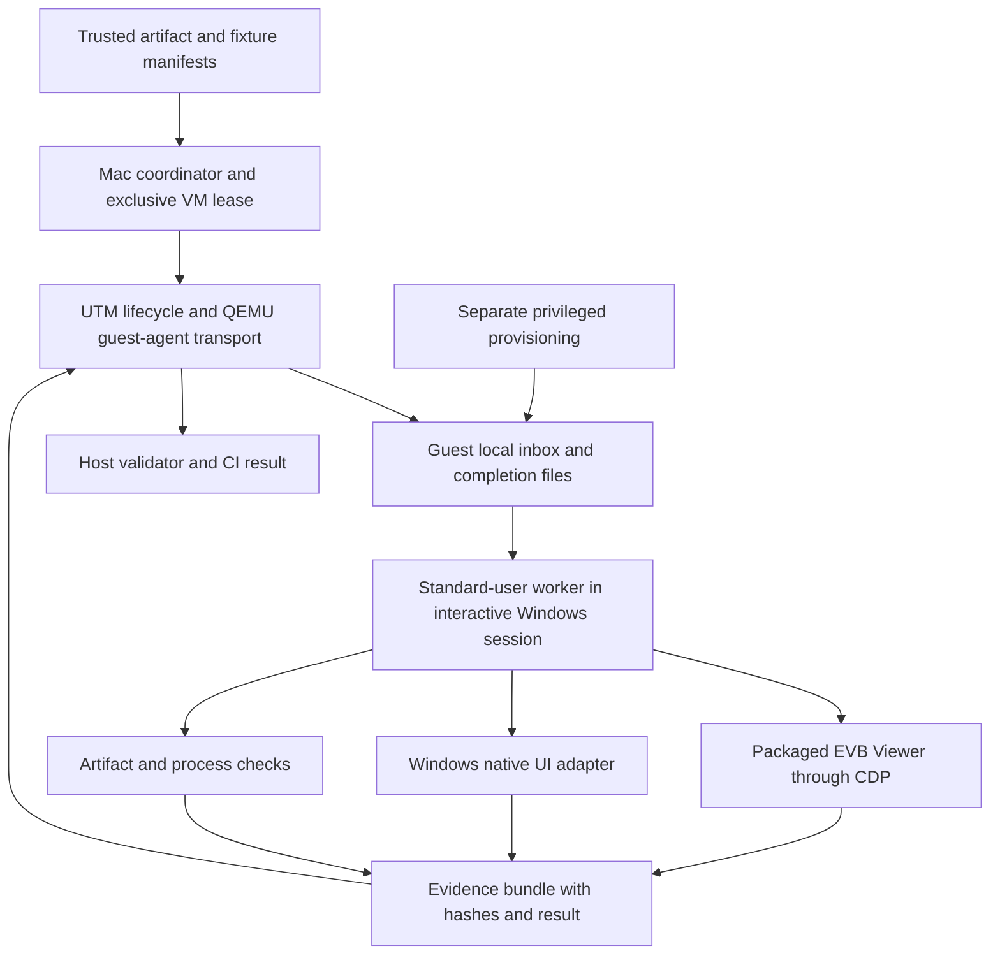

# Windows automation plan for EVB Viewer with UTM

Date: 2026-09-04. Repository baseline: `ce8e95c082abc752446e507f13ed7affe28f66b6`.

Audience: the EVB Viewer maintainer and engineers implementing Windows test infrastructure.

Status: research and implementation plan for a permanent suite runnable on demand on this Mac. The runner, image factory, native UI adapter, and additional tests described below are proposed work. The Windows repair and regression checks described in section 2 have already run. Creating this plan does not install tools, change the VM, or enable scheduled jobs.

Tracking: the [implementation ledger](utm-windows-autotest-implementation-ledger-2026-09-04.md) records package state, closure gates and evidence. This plan stays the design reference; status changes belong in the ledger.

Read sections 1, 3 and 10 for the decision and rollout. Section 7 is the 75-case catalogue; sections 5, 6 and 11 define the runner and operating contract.

[Decision](#1-decision) · [Existing evidence](#2-what-we-already-know) · [Coverage matrix](#3-coverage-boundaries-and-environment-matrix) · [Tool choice](#4-automation-layers-and-tool-decision) · [Architecture](#5-host-and-guest-architecture) · [VM operation](#6-vm-images-reset-and-host-operation) · [Test catalogue](#7-feature-and-scenario-catalogue) · [Oracles](#8-fixtures-and-independent-assertions) · [CI](#9-ci-scheduling-trust-and-release-identity) · [Implementation](#10-implementation-work-packages-and-acceptance-gates) · [Runbook](#11-runbook-and-failure-policy) · [Gaps](#12-open-questions-and-evidence-gaps) · [Sources and reviews](#13-research-sources-and-review-record)

## 1. Decision

Yes. UTM can support a useful automated Windows test environment on this Mac. Use it to start, stop, isolate, and provision Windows. Run the test controller inside the guest, where it can see the Windows desktop, filesystem, processes, and native dialogs directly.

The recommended starting stack is the existing packaged-app Puppeteer/CDP test code, a small Windows-native UI Automation adapter, and UTM guest-agent transport. Keep host Computer Use for diagnosing failures and recovering an environment. Host screenshots and coordinates are too fragile to be the main test driver.

The goal is an explicit test owner and an honest coverage status for every Windows-sensitive feature. One VM cannot prove every Windows configuration. ARM64 Windows running an ARM64 executable, ARM64 Windows emulating an x64 executable, and native x64 Windows are separate coverage targets. Physical printer drivers, GPU behavior, touch devices, and performance on a customer's low-end PC need other environments.

Start with the two regressions that motivated this work. Reproduce both on 0.1.450 and detect them automatically. Then make the same tests pass on the fixed build from a clean test image. That is the first useful deliverable; a large test framework without that demonstration is not.

### What to build first

1. A dedicated test VM and a boot/desktop/transport health check.
2. A guest worker running as an ordinary desktop user, separate from privileged provisioning.
3. A controller that launches the exact packaged executable and verifies its identity.
4. Real delete, save, delete, save, reopen and Microsoft Print to PDF journeys.
5. A result bundle that proves page content and distinguishes app failures from broken test infrastructure.

Reuse hosted Windows jobs. Add the local UTM lane where a Windows client desktop and repeatable interaction are needed. Do not replace working release checks or silently change the current ARM64 release policy.

## 2. What we already know

The local repair ran Windows 11 Pro 25H2, build 26200.8655, ARM64, under UTM 4.7.5 build 118 with its bundled QEMU 10.0.2. The VM configuration allocates 6 GB RAM and leaves the CPU count at the UTM default; record the guest's actual processor count in the image manifest instead of copying it from this note. Updating UTM and using unaccelerated `virtio-ramfb` restored reliable desktop startup. The original disk, EFI variables, TPM state, configuration, and old UTM application were preserved before repair. A normal Windows restart succeeded.

This is a useful diagnostic environment, but it is the user's recovered VM. Do not turn it into the destructive test target. A separate registered VM with a different UTM identity is required before implementing reset, install/uninstall, low-disk, forced-termination, or OS-update scenarios.

The original 0.1.450 app reproduced both reported defects. Save advanced the document revision without advancing its page-identity ledger. A later deletion rejected the mismatch. Printing turned a 12-page fixture into an 881-byte, one-page PDF with no text that still passed `qpdf --check`. The app's CSP blocked Chromium's PDF viewer, and the print handoff lacked a reliable PDF-readiness gate. An additional window-readiness wait could hang indefinitely.

The repaired candidate completed the user's sequence, preserved original pages 2 through 11, and printed twice through the real Microsoft Print to PDF dialog. Both outputs were 165,964 bytes and ten pages. OCR found every expected marker; rasterized pages matched exactly. EVB Viewer reopened the first and last printed pages correctly. The Windows trace records PDF readiness before native dispatch on both prints. It also records `ready-to-show` on that successful run, so the missing event in the earlier stalled run stays unexplained and WIN-PRINT-08 must not assume its cause. All applicable CI jobs passed for the committed source.

The original book was unavailable. These results establish the numbered fixture and the reported sequence, not the original book, every print driver, or native x64 Windows. See the [repair report](windows-v450-print-delete-repair-2026-09-04.md) for hashes and diagnosis.

### Lessons that must become design requirements

| Observation from the repair | Requirement for the runner |
| --- | --- |
| Host accessibility exposed UTM, not Windows controls | Inspect native controls from inside Windows |
| Relative mouse positioning, focus, modifiers, and paste were unreliable | Use semantic selectors and explicit desktop/focus checks; no guessed coordinates |
| Guest-agent processes ran as SYSTEM in Session 0 | Run UI work in the intended interactive user session |
| Some `utmctl` calls returned before evidence files finished, and an error could accompany a zero host exit code | Treat a validated guest completion record as authoritative; never infer success from CLI exit alone |
| `Get-Process.Path` could be empty when inspected from SYSTEM | Record `Win32_Process` executable path, command line, PID, start time, user/session, and process tree |
| Closing a window could leave Electron alive | Verify full process exit before calling a launch fresh |
| A PDF passed `qpdf --check` while completely blank | Combine structure, page count, rendered content, markers, and app reopening |
| Microsoft Print to PDF outlined the text | Use text extraction when available, OCR/rendered checks when text is outlined |
| Runtime policy and timing caused failures that ordinary unit tests missed | Include the shipped CSP, PDF plugin, Windows dialog, spooler, and packaged native tools |

## 3. Coverage boundaries and environment matrix

Microsoft documents x86 and x64 user-mode emulation on Windows 11 ARM. It does not emulate kernel drivers. Therefore a successful x64 executable on ARM does not prove x64 driver behavior or native x64 performance. Record OS architecture and app architecture independently. [Microsoft, how emulation works on Arm](https://learn.microsoft.com/en-us/windows/arm/apps-on-arm-x86-emulation).

| Environment label | Purpose | What it cannot establish |
| --- | --- | --- |
| `utm-win11-arm64-app-arm64` | Fast local Windows client regression lane; native ARM tools; dialogs; filesystem; installation | Native x64 OS behavior; real GPU/printer hardware |
| `utm-win11-arm64-app-x64` | Compatibility of shipped x64 app and user-mode tools under Windows emulation | Native x64 driver behavior or performance |
| `win11-x64-client` | Native x64 Windows client, real x64 binaries, shell, update, printer-driver checks | Every physical device; customer-specific policy |
| Hosted Windows server x64 | Build, unit/native integration, packaging, existing NSIS checks | Windows 11 client UI/Store behavior merely because it is Windows |
| Hosted `windows-11-arm` | Existing ARM64 and emulated-x64 installed AppX checks | Native x64 client coverage |
| Physical Windows certification | GPU, real printer/paper geometry, pen/touch, accessibility tools, hardware performance | Exhaustive coverage of all devices |

GitHub currently lists Windows x64 and `windows-11-arm` hosted runners. Pin the selected label and record the actual image version; `-latest` is not a Windows version contract. Hosted ARM macOS runners do not support nested virtualization, so do not assume the local UTM design can simply be moved inside a hosted macOS runner. [GitHub-hosted runners reference](https://docs.github.com/en/actions/reference/runners/github-hosted-runners).

### Environment variations

Use a small baseline plus named variants. Do not multiply every dimension into every other dimension.

| Dimension | Initial baseline | Deliberate variants |
| --- | --- | --- |
| OS | One pinned, supported Windows 11 Pro ARM64 image | Current supported release/build; update-candidate image; native x64 client |
| App | ARM64 installed NSIS build | x64 NSIS under emulation; AppX; unpacked developer candidate |
| Account | Standard local test user | Provisioning administrator; separate clean user; denied permissions |
| Storage | Guest-local NTFS | UNC/SMB; mapped drive; read-only ACL; removable filesystem; cloud placeholders |
| Language/input | English UI, US keyboard | Russian UI/keyboard; Unicode paths; RTL/IME text where supported |
| Display | Fixed resolution and 100% or 125% Windows scale | 150%, 175%, 200%; mixed-DPI/multi-display lane; app zoom and fit modes |
| Resources | Stable, recorded VM allocation | Low-memory budget; low free space on a dedicated test volume; CPU pressure |
| Connectivity | Explicit test network profile | Offline; interrupted controlled download; proxy/certificate error; slow service |
| Document state | Fresh process and clean profile | Warm repeat; old-version profile; dirty document; recovery journal; multiple tabs |

At minimum, combine the high-risk intersections deliberately: Cyrillic path plus save/replace; open handle plus rotate/save; dirty annotations plus print; high DPI plus native file dialog; AppX plus upgrade/profile retention; signed x64 NSIS plus updater feed and interruption; low memory plus OCR or large-document operation. Pairwise generation is useful for the remaining variants but is not a substitute for these sequences.

## 4. Automation layers and tool decision

| Layer | Driver | Intended evidence | Forbidden substitution |
| --- | --- | --- | --- |
| Pure logic and native processes | Existing Vitest and Rust/native tests in Windows | Protocols, filesystem behavior, arithmetic, error recovery | Calling this proof of a native dialog |
| Packaged renderer interaction | Existing Puppeteer/CDP adapter, stable roles/test IDs, real input events | Toolbar/sidebar/menu behavior, rendering, state transitions | Direct IPC calls as proof that a user gesture works |
| Windows native UI | A narrow UI Automation adapter selected by a proof of concept | File picker, print dialog, save-output dialog, shell and installer windows | Mocking `dialog.showOpenDialog` or calling `printToPDF` as native-print proof |
| Artifact and OS verification | Independent PDF renderers, native tools, filesystem/process/spooler queries | Content, geometry, output identity, process cleanup | Screenshot-only success or file-exists-only success |
| Host diagnostics | Computer Use on the exact UTM window | Recovery, visual confirmation, failure investigation | Silent agent retries or edits that turn a failed test green |

The repository already uses Puppeteer against an explicit packaged executable. Its current [packaged smoke launcher](../../../scripts/release/verifyPackagedCorePdfSmoke.ts#L211) passes sandbox-disabling flags and enables an internal file-open helper. Reuse fixture/assertion code, but do not reuse that launch policy unchanged for Windows production-security or native-dialog acceptance. Build a Windows-specific launch adapter and verify its actual arguments/environment. Extend it before introducing another browser driver. Playwright's Electron support is experimental. It can launch a supplied executable, but it does not intercept native Electron dialogs; its documented stubs bypass the OS interaction. Its launch path also has Electron fuse requirements. A migration must show a benefit and preserve packaged acceptance conditions. [Playwright Electron API](https://playwright.dev/docs/api/class-electron).

Microsoft UI Automation exposes desktop controls and their supported control patterns. Controls are not guaranteed to expose identical patterns or stable names. Enumerate the real dialog trees on each selected Windows image. Target by process/window ownership, control type, automation ID and pattern; use localized names only as a versioned fallback. [Microsoft UI Automation overview](https://learn.microsoft.com/en-us/windows/win32/winauto/uiauto-uiautomationoverview), [UI Automation testing](https://learn.microsoft.com/en-us/windows/win32/winauto/uiauto-usefortesting).

### Native UI adapter selection gate

Evaluate the current Microsoft `winapp` CLI UI Automation commands first as a candidate, not as an already proven dependency. It documents JSON output, control queries/actions, and explicit interactive-desktop failures. Verify its actual release, command schema, ARM64 execution, distribution license, and behavior in the dedicated VM. If it fails the narrow proof, use a small UIA3/FlaUI-based helper. Keep the same adapter contract so test cases do not depend on a CLI's spelling. [Microsoft winapp UI Automation](https://learn.microsoft.com/en-us/windows/apps/dev-tools/winapp-cli/ui-automation).

The researched candidates are:

| Candidate | Evidence as of 2026-09-04 | Decision |
| --- | --- | --- |
| Microsoft WinApp CLI | v0.6.0 supplies ARM64 and x64 packages; public-preview tool; documented JSON/native UI commands | First POC candidate, pin the release and command contract |
| FlaUI UIA3 | v5.0.0 adds .NET 8 support; explicit ARM64 compatibility still needs local proof | Managed helper fallback if WinApp cannot handle required controls |
| Appium Windows driver / WinAppDriver | Appium's maintained wrapper depends on a server its own documentation says has lacked Microsoft maintenance for years | Avoid as the baseline; extra server/compatibility burden without demonstrated benefit |
| Playwright Electron | Experimental Electron support; native-dialog stubs bypass Windows | Optional future renderer alternative; no migration required |

Sources: [WinApp v0.6.0](https://github.com/microsoft/winappCli/releases/tag/v0.6.0), [FlaUI v5.0.0](https://github.com/FlaUI/FlaUI/releases/tag/v5.0.0), [Appium Windows driver](https://github.com/appium/appium-windows-driver).

WinApp documents limited Electron support. Tree inspection and individual control patterns must be proven against EVB's packaged Chromium version. UIA pattern actions may work while the guest is locked; injected clicks/keys require an unlocked interactive desktop. A locked-session pattern check cannot certify a real keyboard or pointer journey. Keep separate driver/action labels in results. [WinApp UI automation support and session requirements](https://learn.microsoft.com/en-us/windows/apps/dev-tools/winapp-cli/ui-automation).

The proof must find and operate the native Print dialog, identify Microsoft Print to PDF, save to an explicit guest-local path, cancel safely, and report a missing/locked desktop as infrastructure failure. Test on both ARM64 and emulated-x64 app builds. Do not assume a wrapper's architecture support from .NET support alone. Do not adopt WinAppDriver/Appium merely because old tutorials use them; assess their current release and compatibility evidence first.

Keep CSP enabled, renderer sandboxing and application security policies intact, and native tools unchanged in acceptance runs. The instrumentation launcher may use a guest-loopback remote-debugging port and an isolated user-data directory, recorded in the manifest. Reject `--no-sandbox`, `--disable-setuid-sandbox`, `--disable-web-security`, certificate-error suppression and any unreviewed policy override in Windows acceptance. A debugger may be used on guest loopback for the instrumentation lane. Add a separate launch without debugging/test flags for package identity, associations, first-run behavior, and native UI certification. If an existing helper opens a file by internal API, label that test as app integration; the real Ctrl+O/file-picker case remains separate.

## 5. Host and guest architecture



The Mac coordinator owns lifecycle and evidence collection. The guest worker owns app actions in the desktop session. Provisioning owns operations that need elevation. Product code does not receive a general-purpose test-command endpoint.

UTM provides scripting and a CLI wrapper for a subset of its scripting interface. QGA supports guest processes and file operations. Capture the installed CLI help and UTM version in the image/runner record rather than guessing flags. The installed 4.7.5 build 118 CLI lists `version`, `list`, `status`, `start`, `suspend`, `stop`, `attach`, `file`, `exec`, `ip-address`, `clone`, `delete` and `usb`. It has no snapshot or restore command, and its own help states that `delete` asks for no confirmation. [UTM scripting](https://docs.getutm.app/scripting/scripting/), [UTM scripting reference](https://docs.getutm.app/scripting/reference/), [QEMU guest-agent protocol](https://www.qemu.org/docs/master/interop/qemu-ga-ref.html).

The tagged v4.7.5 CLI source adds two concrete constraints. `utmctl exec` waits for guest exit but has no timeout; when a guest crash provides a signal instead of an exit code, the CLI can default to zero. The earlier premature-return observations may involve child/background work and must not be generalized to every synchronous command. Keep the guest completion protocol and supervise transport separately. QGA's captured output is bounded, so stream durable logs into files and detect truncation. [UTM CLI implementation](https://github.com/utmapp/UTM/blob/v4.7.5/utmctl/UTMCtl.swift), [QGA v10.0.2 status handling](https://github.com/qemu/qemu/blob/v10.0.2/qga/commands.c).

### Interactive session is a prerequisite

A process started by the guest agent is not automatically a desktop process. Windows services normally run on a noninteractive station in Session 0. Keep the UI worker in the intended logged-on user's interactive session. A preprovisioned logon task with the appropriate interactive token is one option; it does not log in or unlock a user by itself. The worker must report its user SID, session ID, integrity level, input desktop, and test window ownership before the run starts. [Microsoft interactive services](https://learn.microsoft.com/en-us/windows/win32/services/interactive-services), [Task Scheduler security contexts](https://learn.microsoft.com/en-us/windows/win32/taskschd/security-contexts-for-running-tasks).

For native input journeys, a locked guest, missing console session, UAC secure desktop, conflicting RDP session, or inactive UI worker is an infrastructure condition. Do not disable UAC, change security desktops, or pretend a Session 0 launch is a user journey. A one-time, explicitly managed lab sign-in policy may be needed for unattended cold boot. Keep that decision separate from the test runner and out of the personal VM. Provisioning credentials must not appear in job files or logs.

### Job protocol

Use a bounded job description with a fixed schema and allowlisted task IDs. Copy artifacts into a per-run directory on guest NTFS, verify hashes, and publish the ready marker only after validation. Avoid a broad mounted host checkout. The worker must reject stale run IDs, unsupported schema versions, paths outside its root, duplicate execution, and an artifact whose hash does not match.

Use separate guest-local inbox, outbox and worker-state directories. Provision their ACLs explicitly: SYSTEM/administrators can stage and collect, the test-user SID can read staged jobs and write its results/state, and other ordinary users have no access. Separate immutable staged inputs from writable working copies. Validate effective ACLs and cross-session read/write during M0; do not assume inherited permissions are correct. UI screenshots and control-tree capture run in the interactive worker. Check the session/input desktop directly; a black image alone does not establish lock state.

The initial implementation can use file mailboxes transported by QGA; a network service is unnecessary. If networking is added, authenticate requests and bind to the intended interface. Do not expose CDP or a command broker to the LAN.

Illustrative protocol, not an implemented API:

```json
{
  "schemaVersion": 1,
  "runId": "unique-random-run-id",
  "sourceSha": "full-git-sha",
  "artifactSha256": "verified-installer-or-package-hash",
  "imageId": "win11-arm64-pro-25h2-baseline-001",
  "vmId": "allowlisted-test-vm-uuid",
  "bootId": "fresh-worker-boot-handshake-id",
  "guestTestMarker": "provisioned-test-clone-identity",
  "runnerVersion": "pinned-runner-revision",
  "suite": "windows-critical",
  "tests": ["WIN-SAVE-01", "WIN-PRINT-01"],
  "fixtureManifestSha256": "verified-fixture-manifest-hash",
  "expectedOsArch": "arm64",
  "expectedAppArch": "arm64",
  "deadlineSeconds": 1200
}
```

The result needs the same run ID, VM/image/boot identities, a terminal state, test and assertion counts, expected versus executed test IDs, start/end timestamps, actual platform/build/architecture, artifact identity, worker/session identity, evidence manifest hash, and failure classification. Write a temporary result, flush/close it, then rename it into place. The host checks the result and all referenced hashes after transfer. An empty result, missing test, truncated log, or unexpected process is never success.

Use QGA `exec` for short probes and starting preprovisioned work, not for a long-lived GUI controller. Host cancellation of the CLI does not prove guest process termination. Long jobs use the mailbox and guest watchdog; termination requires owned PID, start time and executable checks.

A host CLI exit code is transport evidence only. Require bounded polling for a guest terminal record. Preserve guest stdout/stderr and exception information. Use Windows-safe argument handling and file-based scripts or encoded commands instead of interpolating arbitrary PowerShell into shell strings. Treat filenames and document contents as data.

### State and timeout model

`queued -> leased -> booting -> guest-ready -> desktop-ready -> staged -> installed -> launched -> testing -> collecting -> tearing-down -> complete`

Every transition records a monotonic elapsed time and a reason. The coordinator distinguishes these terminal outcomes:

- `passed`: every required test and oracle completed for the requested artifact and environment.
- `product-failed`: an app assertion, crash, corruption, incorrect output, or supported-operation failure.
- `infrastructure-failed`: the VM, session, transport, driver, or evidence collection failed independently of the app assertion.
- `unsupported`: the requested capability is unavailable in that named environment; this is not a pass.
- `canceled`: an operator or higher-priority task canceled the run.

Classification must not discard an earlier product failure if teardown or collection also fails. Keep both. Do not infer infrastructure failure merely because the app timed out. Record enough evidence to tell a blocked native dialog from a failed guest agent.

Proposed initial deadlines are boot/guest-ready 180 seconds, desktop-ready 60 seconds after guest-ready, ordinary UI step 30 seconds, and a separate 120-second hard ceiling for the small print-readiness fixture even if the app never resolves its own wait. Native print completion has its own measured job budget, distinct from plugin readiness. Large-file and OCR cases get named budgets derived from measurements. These are starting limits to validate, not measured service guarantees. Use readiness events and output conditions, not fixed sleeps as success criteria.

## 6. VM images, reset, and host operation

### Baseline image contract

Build the golden test image from a fresh Windows 11 Pro ARM64 installation using Microsoft media and nonproduction test accounts. The recovered personal VM is neither the test target nor the clone source. Do not inherit browser sessions, OneDrive accounts, documents or cached personal credentials. After provisioning and validation, shut down the golden image and create working clones with the supported UTM mechanism. Verify distinct VM UUID, distinct storage paths, no shared writable virtual disk, and a test-only marker. Refuse the recovered personal VM's UUID and any path outside the test-image root.

The v4.7.5 clone implementation copies the bundle and creates a new UTM UUID/name; network MAC regeneration is conditional. It does not automatically create a unique Windows hostname, guest account or test marker. Provision these after cloning and verify MAC uniqueness before allowing concurrent network access. Record the VM list before and after clone and require exactly one new registered UUID, because the CLI does not return it. Refuse ambiguity; never identify a destructive target by display name alone. The recovered personal VM is registered under the generic display name `Windows`, so a name match is worthless as a safety check. [UTM clone implementation](https://github.com/utmapp/UTM/blob/v4.7.5/Platform/UTMData.swift#L498-L525).

A complete reset unit includes disk, VM configuration, EFI variables, TPM state, removable-media configuration, and guest/image manifest. Do not restore only the OS disk while retaining unrelated TPM/EFI state. Inspect where the current UTM version stores each item and prove restored boot and BitLocker state. Never use `qemu-img` against an active disk. Keep the golden image stopped and immutable. APFS copy-on-write copies may reduce storage cost, but measure real allocated growth and cleanup behavior.

UTM documents a QEMU disposable mode that discards writes to mounted drives at shutdown. That description does not by itself prove rollback of TPM, EFI, configuration, shared directories, or network side effects. It also discards evidence stored only in guest drives. Evaluate it as an optimization after full reset is proven, not as the first isolation contract. [UTM disposable mode](https://docs.getutm.app/advanced/disposable/).

The current VM has an emulated NVMe disk. UTM v4.7.5 rejects saved suspend state with NVMe, GPU acceleration or disposable mode. Do not use `suspend --save-state` as the reset mechanism for this configuration. Full stopped-bundle baseline/clone restoration is the initial design. Bundle copies contain TPM and guest secrets, so restrict host access and retention; guest BitLocker does not make a copied VM plus TPM state safe to publish. [UTM snapshot checks](https://github.com/utmapp/UTM/blob/v4.7.5/Services/UTMQemuVirtualMachine.swift#L236-L258), [UTM security notes](https://docs.getutm.app/settings-qemu/qemu/).

For upgrade/recovery scenarios, preserve disk state across the required app or Windows restart within the scenario. Reset between independent scenarios or suite groups according to their isolation contract. A generic cleanup hook must not erase a journal before the recovery assertion observes it.

A stopped cloned baseline implies a cold boot after every full reset. Until the isolated image has a qualified automatic sign-in mechanism, reset runs require lab sign-in and are assisted, not unattended. M0 must choose and prove that mechanism before advertising unattended clean runs. Restricting work to an already signed-in session permits warm diagnostic runs only; it cannot satisfy cold-reset qualification. Keep device encryption at the image's intended default and record its state. Resolve lawful Windows licensing, activation and any recovery-key handling before image promotion; do not assume cloning preserves activation or makes additional installations free.

Provision a small resettable NTFS scratch virtual disk for cross-volume temp and low-space tests. Fill only that disk or a bounded test VHD, with a host/guest free-space reserve; never fill the OS or host volume. Optional exFAT/removable simulations use separately identified test disks. Include every writable disk and its reset policy in the manifest. Attach any read-only fixture media before boot, and exclude external persistent side effects from rollback claims.

After evidence retention expires, stop the owned clone and recheck its UUID, resolved bundle path and guest marker record. The v4.7.5 `delete` command removes the stopped VM and its bundle without confirmation; the coordinator must guard it before invocation and verify both deregistration and storage removal afterward. Never invoke delete on the golden or personal VM. [UTM scripting lifecycle guards](https://github.com/utmapp/UTM/blob/v4.7.5/Scripting/UTMScriptingVirtualMachineImpl.swift#L170-L216).

### Display and unattended host conditions

Retain a virtual display and a functioning Windows desktop for GUI tests. UTM's documented headless configuration removes display devices, which is a different setup from leaving a GUI VM running with its host window covered or minimized. Do not use that mode as evidence of GUI behavior. UTM itself must remain running. [UTM headless mode](https://docs.getutm.app/advanced/headless/).

The installed CLI uses macOS ScriptingBridge and explicitly warns that it does not work from SSH sessions or before login. Run the Mac coordinator in the logged-in test account's GUI session, for example through a provisioned LaunchAgent. A remote CI request can enqueue a trusted job for that coordinator; it must not assume `ssh mac utmctl ...` is a supported unattended path. Test macOS Automation permission during setup. A read-only probe on 2026-09-04 shows why: run from a launcher without Automation consent, `utmctl version` and `utmctl list` failed with OSStatus -1743 while the CLI's message blamed SSH. The error text does not identify the real cause, so `doctor` must report the launcher, the consent state and the raw OSStatus instead of echoing that message. A machine reboot requires restoring the host GUI-session precondition before jobs can resume. [Tagged CLI session checks](https://github.com/utmapp/UTM/blob/v4.7.5/utmctl/UTMCtl.swift#L47-L124).

Phase 0 must test visible, occluded, and minimized UTM states separately, plus host lock and guest session loss. Only advertise unattended operation in states that preserve guest rendering/input and pass the probes. Host sleep, logout, UTM exit, or a locked guest must stop scheduling or classify the run as infrastructure failure. Do not change the user's Mac lock/sleep policy globally. Initially run the coordinator and UTM in the same currently logged-in macOS GUI session during explicit lab windows. Sharing that session with normal work requires the occluded-window and interference probes to pass. A separate host account is not a promise of simultaneous unattended GUI operation; qualify fast-user-switching or use a dedicated Mac before relying on it. M0 must probe Automation permission from each actual launcher, such as Terminal or the later LaunchAgent, because consent attribution cannot be inferred solely from the Node executable. Record qualified launchers in setup, have `doctor` check the current path, and repeat this check after launcher/coordinator updates.

One coordinator lease owns a VM. Native GUI scenarios run serially per guest desktop. Pure native/unit cases may run in parallel within measured CPU/RAM limits, but cannot change printer, clipboard, profile, display, or package state while a GUI test owns them. Start with one running test VM on this Mac. Do not promise parallel foreground Computer Use across VMs.

### Sharing, fixtures, and recovery

Use guest-local NTFS for baseline save/replace tests. UTM's Windows shared folder is normally SPICE WebDAV on the guest's localhost, not NTFS or SMB. Test it as a separate storage capability. Turn host clipboard synchronization off for normal clipboard assertions; explicitly enable it only in a sharing test. [UTM sharing](https://docs.getutm.app/settings-qemu/sharing/).

Keep evidence collection independent of the app. First pull the result and logs through the healthy guest channel. If it fails, preserve host UTM state/logs and leave the failed test clone intact for bounded diagnosis. Do not repair the VM and then claim the interrupted run passed. Recovery may produce a new run ID after retaining the first failure.

Proposed retention: golden image plus previous known-good image, one active clone, and at most one retained failed clone per host. Keep compact pass manifests and failure evidence for a defined period, for example 7 and 30 days respectively. Cap total bytes and reserve enough free disk for the next clone and evidence. These values are operational defaults to calibrate. If space is insufficient, refuse the run; do not prune a live VM, the personal VM backup, or the only failure evidence automatically.

## 7. Feature and scenario catalogue

The catalogue below is the proposed coverage obligation, not a statement that all cases exist. Each row must become a registry entry with exact source/test anchors and a status. A capability absent from the product should be marked not applicable with the source evidence, not implemented merely to satisfy a checklist.

Priorities: P0 blocks promotion after qualification; P1 runs nightly and before relevant releases; P2 runs on a specific device, environment, or scheduled compatibility sweep. Drivers: APP means real packaged renderer actions, WIN means native Windows UI, NATIVE means process/filesystem/native-tool checks, HARDWARE means a separate physical-device lane.

### 7.1 Printing

| Test ID | Scenario | Driver / priority | Required oracle |
| --- | --- | --- | --- |
| WIN-PRINT-01 | Open numbered PDF, print all pages through Microsoft Print to PDF, save output, repeat warm | WIN / P0 | Native dialogs observed; correct page count, markers, geometry and nonblank content on every page; reopen output |
| WIN-PRINT-02 | Delete beginning, save, delete end, save, print and reopen | APP + WIN / P0 | Exactly the surviving pages in order; no stale revision error; source and print output both checked |
| WIN-PRINT-03 | Print current page and explicit ranges, including invalid/empty ranges | APP + WIN / P1 | Selected content only; invalid input has actionable error and no partial job |
| WIN-PRINT-04 | Facing pages and facing-first-single; odd/even page counts | APP + WIN / P1 | Sheet orientation, blank slots, ordering and scale match the layout contract |
| WIN-PRINT-05 | Portrait/landscape/auto; mixed page sizes, crop boxes and rotations | APP + WIN / P1 | MediaBox/CropBox plus rendered registration marks and orientation |
| WIN-PRINT-06 | Print unsaved annotations, form changes, OCR or page edits where supported | APP + WIN / P0 | Output reflects intended current state, no silent omission or unintended source write |
| WIN-PRINT-07 | Cancel app dialog, native dialog and output picker; retry; existing filename/overwrite refusal | WIN / P0 | No stray output, stuck progress, orphan window or poisoned next print |
| WIN-PRINT-08 | Slow PDF readiness; renderer exits; close owner window; close app during preparation | NATIVE + WIN / P1 | Bounded failure/cancel, no blank fallback, no orphan processes; next session can print |
| WIN-PRINT-09 | No printer, default-printer change, offline queue, failed spooler, repeated jobs | WIN + NATIVE / P1 | Correct printer/error, explicit outcome, owned job cleanup, no collateral queue changes |
| WIN-PRINT-10 | Actual supported physical printers, duplex, copies, paper size, margins and driver defaults | HARDWARE / P2 | Inspect real output and spooler status; PDF-printer success is not substituted |

### 7.2 Saving, editing, identity and recovery

| Test ID | Scenario | Driver / priority | Required oracle |
| --- | --- | --- | --- |
| WIN-SAVE-01 | Delete leading pages, save, delete trailing pages, save, quit, reopen | APP + NATIVE / P0 | Surviving markers/order; stable surviving page IDs; synchronized revision tokens; no error |
| WIN-SAVE-02 | Annotate, save, edit again, save; Save As with native picker | APP + WIN / P0 | Fresh-process content/annotation persistence; original isolation for Save As |
| WIN-SAVE-03 | Rotate, reorder, duplicate, insert, extract, combine and delete supported page sets | APP / P1 | Page content, labels, bookmarks, links and annotations remap according to contract |
| WIN-SAVE-04 | Another process holds the source with delete-sharing denied during replacement/append | NATIVE + APP / P0 | Native Windows sharing behavior; safe success or specified error; no loss/truncation |
| WIN-SAVE-05 | Access denied, read-only directory, read-only file, file removed/renamed externally | NATIVE + APP / P1 | Clear error, preserved source and edits, retry after condition clears |
| WIN-SAVE-06 | Space exhausted on a dedicated test volume during save/temp write | NATIVE + APP / P1 | Original or committed output remains valid; no false success; recovery works |
| WIN-SAVE-07 | Kill owned app/worker at staged content and sidecar transition boundaries | NATIVE / P1 | Journal recovery, consistent page identities, preserved data; fresh reopen |
| WIN-SAVE-08 | Corrupt/missing revision or identity sidecar, pending and no-pending journal | NATIVE + APP / P0 | Correct quarantine/reseed or fail-closed behavior; no recovery loop |
| WIN-SAVE-09 | Rapid repeated Save, tab switch, document close, app quit and shutdown during save | APP + WIN / P1 | Serialized/consistent result; unsaved-data prompt obeyed; no dropped edits |
| WIN-SAVE-10 | External modification while open; reopen/reload conflict handling | APP + NATIVE / P1 | Documented conflict behavior; no unnoticed overwrite |
| WIN-SAVE-11 | Large PDFs and multi-GB offsets; low-memory admission boundary | NATIVE + APP / P1 | Correct admission, bounded resources, complete output or explicit rejection |
| WIN-SAVE-12 | Undo/redo around page edits and save; repeat after reopened state | APP / P1 | Documented undo scope and correct saved bytes, labels and identity state |

Do not equate process termination with power-loss testing. Deterministic fault hooks and held file handles belong in the native/transaction lane. A full guest power interruption is a separate, destructive test against a disposable clone; label it separately and preserve the failed disk before recovery.

### 7.3 Filesystem and paths

| Test ID | Scenario | Driver / priority | Required oracle |
| --- | --- | --- | --- |
| WIN-PATH-01 | Spaces, Cyrillic, non-BMP Unicode, combining characters and RTL names | WIN + APP / P0 | Open/save/export/reopen exact path; no encoding loss or argument splitting |
| WIN-PATH-02 | Long paths, UNC prefix, reserved device names, trailing dot/space, invalid characters | WIN + NATIVE / P1 | Supported paths succeed; invalid/unsupported paths fail explicitly without writing elsewhere |
| WIN-PATH-03 | UNC/SMB and mapped drive; disconnect during read/save | APP + NATIVE / P1 | Correct read/write and safe interrupted outcome; no assumption of local atomicity |
| WIN-PATH-04 | UTM WebDAV share and host/guest clipboard sharing as explicit integration cases | WIN + NATIVE / P2 | Provider-specific behavior recorded; baseline NTFS tests remain independent |
| WIN-PATH-05 | OneDrive/cloud placeholder hydration, offline placeholder, sync conflict | WIN + NATIVE / P2 | Named provider/account environment; hydration/error and conflict behavior, no silent corruption |
| WIN-PATH-06 | Removable NTFS/exFAT media and controlled disconnect | HARDWARE or dedicated disk / P2 | Preserved source, correct retry/error; recorded filesystem and device |
| WIN-PATH-07 | Temp path on different volume, cleanup, leftover locks after quit | NATIVE / P0 | Correct transaction fallback; owned residue policy; files can be reopened/replaced after exit |
| WIN-PATH-08 | Junctions, symlinks and reparse points inside managed roots; required privilege recorded | NATIVE / P0 | Managed-root guards prevent outside-root access/deletion; unsupported setup is explicit |
| WIN-PATH-09 | Case variants, alternate separators, drive/UNC aliases and same-size/backdated external edits | NATIVE + APP / P1 | One intended document identity, conflict fencing and no unnoticed overwrite |

### 7.4 Installation, shell and application lifecycle

| Test ID | Scenario | Driver / priority | Required oracle |
| --- | --- | --- | --- |
| WIN-INSTALL-01 | Fresh NSIS install in supported user/machine scope, standard-user app launch | Provisioning + WIN / P0 | Exact installed executable and native-tool hashes, scope, ACL, version, first-run behavior |
| WIN-INSTALL-02 | Native installer wizard, cancel, invalid location, existing install | WIN / P1 | Supported ordinary-desktop steps work; elevation boundary explicitly classified |
| WIN-INSTALL-03 | N-1 to N update for an updater-eligible signed x64 target; manual upgrade for other NSIS targets | Provisioning + APP / P0 | Real eligible update route, settings/recent files and dirty-document behavior; restart into N; retained data; no partial install |
| WIN-INSTALL-04 | Eligible updater target: interrupted/failed update, offline or invalid feed/hash/certificate | Controlled service + APP / P1 | Reject bad update, preserve usable installation and user data, retry behavior |
| WIN-INSTALL-05 | Uninstall while app closed/running; reinstall; user-data retention policy | Provisioning + WIN / P1 | Expected package/process/association removal; no unexpected deletion of documents |
| WIN-INSTALL-06 | AppX install, launch, upgrade and uninstall for both app architectures | Provisioning + WIN / P0 | Package identity/architecture, installed path and data isolation; distinguish test signing from Store delivery |
| WIN-SHELL-01 | Explorer double-click/Open With, arguments from file association, multiple files | WIN / P0 | Correct app receives exact paths; source documents not changed just by opening |
| WIN-SHELL-02 | Second instance, multiple windows/tabs, already-open document, cold launch | WIN + NATIVE / P0 | Single-instance/document routing contract; no dropped requests or unintended duplicate app |
| WIN-SHELL-03 | Recent items, missing files, reveal in Explorer, supported external links | APP + WIN / P1 | Correct destination and safe handling; no shell injection from filenames |
| WIN-SHELL-04 | Taskbar, minimize/maximize, close versus quit, restart session | WIN + NATIVE / P1 | Window state and process lifetime match product behavior; no offscreen restored window |
| WIN-SHELL-05 | Download-origin installer and document, reputation/security prompts | Dedicated certification / P2 | Record Zone.Identifier, signature and provenance; QGA transfer alone does not represent a browser download |
| WIN-SHELL-06 | Set-default-viewer prompt and Windows Default Apps settings handoff | WIN / P1 | Actual settings window or intended fallback; association result verified separately |
| WIN-INSTALL-07 | Legacy Windows package declared by current build policy | Separate legacy OS / P2 | Exact legacy artifact on its supported OS; Windows 11 UTM cannot certify that target |

A silent provisioning install proves the installed result and app behavior. It does not prove the installer wizard or the user's UAC interaction. Keep standard-user wizard steps, privileged provisioning, and secure-desktop certification as different cases. A medium-integrity worker cannot assume control of an elevated wizard. If per-machine wizard coverage is needed, qualify a separate elevated UI worker with the same user/session and required integrity as the installer; secure UAC consent still remains outside the ordinary worker. Do not add uiAccess or weaken UIPI merely for test convenience. Do not automate approval by disabling UAC. Test Store-signed delivery separately from a locally test-signed AppX. The existing [release guardrails](../../contributing/release-guardrails.md) and [updater canary](../../contributing/release-updater-canary.md) remain authoritative product policies.

### 7.5 PDF, native tools and conversion

| Test ID | Scenario | Driver / priority | Required oracle |
| --- | --- | --- | --- |
| WIN-PDF-01 | Open/search/select/navigate normal, scanned, mixed-size, encrypted and malformed PDFs | APP + NATIVE / P0 | Correct content/errors; keyboard navigation and no crash; password/cancel path |
| WIN-PDF-02 | Unicode/RTL/CJK/embedded and fallback fonts, ligatures and text extraction | APP + WIN / P1 | Known text and glyphs; selection/copy/search order; no missing glyphs |
| WIN-ANN-01 | Supported annotation types, FreeText/note windows, color/opacity/geometry, save/reopen | APP + WIN / P0 | Annotation objects and visible appearance; focus, text editing and persistence |
| WIN-ANN-02 | Links, bookmarks, page labels, form fields and signatures through supported edits | APP + NATIVE / P1 | Explicit preservation/invalidation contract; no invented support for unsupported editing |
| WIN-OCR-01 | OCR languages/scripts, page ranges, cancel/retry and worker failure | APP + NATIVE / P1 | Searchable expected text, geometry, subprocess architecture and cleanup |
| WIN-DJVU-01 | DjVu open/render/export/convert, metadata/text and cancellation | APP + NATIVE / P1 | Correct images/text/page count; compatible PDF output; Windows tool paths |
| WIN-IMAGE-01 | Supported image import/combine/export formats, multipage TIFF and EXIF orientation | APP + NATIVE / P1 | Image count, resolution, color, orientation, alpha and output validity |
| WIN-SCAN-01 | Cleanup presets, crop/deskew/rotation, preview/apply/export, cancel and rollback | APP + NATIVE / P1 | Existing scan-cleanup oracle plus visual/reference checks; no tone/crop/content loss |
| WIN-TOOLS-01 | Every bundled Windows executable/worker loads from installed package, not host PATH | NATIVE / P0 | Architecture/protocol/version/hash, ASAR unpack layout, no stray console windows, predictable missing-tool error |
| WIN-TOOLS-02 | Concurrent heavy tasks, process crash, cancel, admission denial and retry | APP + NATIVE / P1 | Broker/heap budget, correct failure, no leaking worker or deadlocked queue |
| WIN-SEARCH-01 | Packaged persistent native search, index build, cancel, selected-match navigation and idle shutdown | APP + NATIVE / P1 | Correct matches/page location, daemon architecture, no stale result or surviving owned process |

Scanner acquisition, shell preview/thumbnail extensions, pen pressure and any other suspected feature must first be confirmed in source. If absent, registry entries say not applicable. Do not expand the product to turn such rows green.

### 7.6 Input, display and accessibility

| Test ID | Scenario | Driver / priority | Required oracle |
| --- | --- | --- | --- |
| WIN-UI-01 | Windows Ctrl/Alt shortcuts, context menu, menu accelerators and focus return | APP + WIN / P0 | Actual input reaches the right control; no macOS modifier assumptions |
| WIN-UI-02 | Native open/save picker navigation, cancel, overwrite, Unicode names and keyboard-only use | WIN / P0 | Actual dialog controls and resulting path; no internal open/save API substitute |
| WIN-UI-03 | Copy/paste text, annotations or images only where supported; clipboard formats | APP + WIN / P1 | Data and Unicode fidelity; guest-local clipboard; no accidental host sharing dependency |
| WIN-UI-04 | Drag/drop from Explorer, multiple files, rejected types, drop while busy | WIN / P1 | Correct gesture and routing, no duplicate imports or shell-path corruption |
| WIN-UI-05 | High DPI and resize, app zoom/fit modes, large sidebar/search results | APP + WIN / P1 | Hit-testing, clipping, scroll position and focused page; geometry assertions plus images |
| WIN-UI-06 | Mixed DPI/multiple displays, move windows, disconnect display, restore saved position | Qualified VM or HARDWARE / P2 | Reachable windows/dialogs; physical-pixel versus logical-coordinate behavior |
| WIN-UI-07 | Keyboard layouts, dead keys, IME, Russian shortcuts and RTL annotation editing | APP + WIN / P1 | Correct committed text, composition/focus, no shortcut collision |
| WIN-UI-08 | High contrast, light/dark mode, reduced motion and text scaling | APP + WIN / P1 | Usable controls/contrast and no clipped actionable content |
| WIN-UI-09 | UI Automation names/roles/patterns, tab order, Narrator or selected screen reader | WIN + assistive technology / P2 | Semantic navigation and announcement; automation-tree success alone is not screen-reader certification |
| WIN-UI-10 | Touch, pen, gesture and precision-wheel/trackpad behavior where supported | HARDWARE / P2 | Real device input and supported product contract |

Electron can enable its accessibility tree in response to assistive technology. Prove how the chosen Windows driver obtains that tree on the shipped app. Record any forced-accessibility flag as a test condition; an accessibility-enabled run is not the only rendering/performance baseline. [Electron accessibility](https://www.electronjs.org/docs/latest/tutorial/accessibility).

### 7.7 Resources, security and network behavior

| Test ID | Scenario | Driver / priority | Required oracle |
| --- | --- | --- | --- |
| WIN-RESOURCE-01 | Repeated open/edit/save/print/close and many tabs | APP + NATIVE / P1 | Bounded handles, processes, memory, temp storage and no progressive failure |
| WIN-RESOURCE-02 | Large page count, >4 GiB files/offset boundaries, low-memory Windows profiles | APP + NATIVE / P1 | Correct supported limit/admission and output; no overflow or silent truncation |
| WIN-RESOURCE-03 | Host pause, guest sleep/resume, app suspend and worker/session interruption | Controlled environment / P2 | Explicit cancellation/recovery and no stale result accepted as a new run |
| WIN-RESOURCE-04 | Real low-end x64 and ARM hardware latency/resource measurements | HARDWARE / P2 | Cold/warm percentiles, peak memory/handles; separate from VM timing |
| WIN-SEC-01 | Production CSP/sandbox/permissions on native PDF print and ordinary app routes | APP + WIN / P0 | Correct renderer policy and functioning PDF plugin; no bypass flags |
| WIN-SEC-02 | Filenames, paths, links and metadata containing shell/metacharacter input | NATIVE + APP / P1 | Inputs remain data, no unintended command, path escape or external open |
| WIN-SEC-03 | Diagnostics consent default, logs, crash/error collection and redaction | APP + controlled endpoint / P1 | No unsolicited real telemetry; correct consent behavior and redaction |
| WIN-NET-01 | Offline startup/open/save; update check and supported online requests fail | APP + controlled service / P1 | Local work remains usable; bounded error and retry |
| WIN-NET-02 | Proxy, TLS/certificate error, redirects and interrupted controlled transfers | APP + controlled service / P2 | Correct validation/rejection without disabling TLS checks |
| WIN-SEC-04 | Defender/reputation interaction with actual packaged tools and downloads | Dedicated certification / P2 | No silent exclusion; quarantine or block recorded with source/provenance |

### Registry completeness rule

Every capability row needs an implementation status such as planned, implemented, unsupported-in-environment, not-applicable or quarantined, plus a separate gate policy of advisory or required. Record the primary owning environment and each required variant so hosted native tests and UTM ARM integration do not get counted twice. Required entries must reference a real test ID, fixture manifest, environment, driver, assertion list and owner role. A registry lint must reject missing tests, duplicate IDs, empty oracles and required cases that are skipped. Source ownership changes and new Windows/platform branches trigger registry review. Report coverage by capability and environment with an explicit denominator; do not publish a single percent that conflates planned and proven cases.

## 8. Fixtures and independent assertions

### Fixture packs

| Pack | Contents | Why it exists |
| --- | --- | --- |
| F01 numbered PDF | 12 pages with unique text, vector marks, border and distinct colors | Exact delete/save/delete and print ordering; each page has an independent identity |
| F02 metadata/annotations | Labels, bookmarks, named destinations, links, supported annotations and form values | Persistence and remapping across save/rotate/insert/extract |
| F03 rendering | Text, scans, tinted paper, photos, maps, fine lines, transparency, mixed boxes/rotations | Detect blank, washed-out, clipped, rotated and tone-damaged output |
| F04 fonts and language | Embedded/fallback fonts, Cyrillic, RTL, CJK, ligatures and Unicode filenames | Windows font, text, input and path behavior |
| F05 protected/invalid | Password-protected, read-only, truncated/malformed and unusual but supported PDF structures | Error/cancel/recovery paths without corrupting good sources |
| F06 heavy | Large page count, image-heavy and sparse/multi-GB boundary files | Resource admission and file-offset correctness, with documented supported limits |
| F07 formats/native | DjVu, supported image formats, multipage TIFF, OCR languages and cleanup cases | Packaged Windows tools, subprocesses, color and conversion behavior |
| F08 transaction states | Valid and corrupt sidecars, old schema, staged journals, held Windows file handles | Deterministic recovery and sharing regressions |
| F09 installer/profile | N-1 profiles/settings and verified N/N-1 artifacts, download-origin metadata | Upgrade, uninstall/reinstall and provenance |

Each fixture has a stable ID, SHA-256, byte size, license/permission, expected pages/markers/metadata, intended variants, source provenance, and whether it is safe to publish in CI artifacts. Use synthetic fixtures for routine runs. Customer documents require explicit handling rules and should not be uploaded by default. Large fixtures are provisioned once into a versioned cache or separate read-only fixture volume, then verified before use. Copy writable working inputs to per-run NTFS. Measure installer/package and fixture transfer throughput in M0. If QGA is too slow, prefer a hash-verified read-only ISO or fixture disk attached before boot. A controlled guest-to-host HTTP download is another option only with a scoped endpoint, explicit network profile and hash verification; it is not a LAN command service. Do not send `node_modules` and multi-GB fixtures through QGA on every run.

### Assertions that determine success

Run app reopen, Windows UI, process, spooler and filesystem checks inside the guest. Run independent parsers/renderers and contact-sheet comparison on the host after collecting and hashing the exact output. Record oracle versions and provenance. This keeps the guest small while preserving Windows evidence. Host rendering does not replace the guest's actual EVB render/reopen assertion.

1. Check exact source and result paths, byte hashes where stable, file size bounds and format validity.
2. Inspect page count, dimensions, boxes, rotation and expected metadata/annotation fields with an independent parser.
3. Render every page of the small smoke fixture using the app's configured PDF.js path and a reference renderer. Apply the tracked [generated-PDF verifier](../../../scripts/diagnostics/verify-generated-pdf.py) and its classifier rather than inventing a weaker Windows-only checker. The `verify-generated-pdf` agent skill that wraps it lives under the gitignored `.agents/skills/` directory, so the runner must depend on the tracked script, not on the skill.
4. Verify unique expected markers by text extraction when present and OCR when the driver outlines text. An OCR failure is a failed or inconclusive assertion requiring investigation, never automatic acceptance because the page looks nonblank.
5. Compare geometry and content masks against a reference with documented tolerances. Exact pixels can be required for repeated output under the same pinned environment when justified; use calibrated tolerances across different font/driver/OS builds. A blanket nonwhite-pixel threshold cannot prove correct content.
6. Reopen the saved/printed file in a fresh app process and navigate to representative first/last and metadata-sensitive pages. For small fixtures, render-check all pages.
7. Confirm source isolation, sidecar/journal state, expected dirty state, no owned process survivors, and release of handles needed for the next operation.

Existing generated-PDF acceptance also requires human inspection of contact sheets and app screenshots. Automatic runs can produce and compare this evidence, but they must report the human-review obligation separately. Do not label a scheduled machine result as completing that review. Use automated assertions for routine regressions and retain the repository's visual review requirement for final certification or changed representation paths.

### Negative controls

Before making a scenario blocking, prove its oracle rejects a known failure. Use official 0.1.450 for the blank-print and delete/save/delete controls. If another original defect cannot be reproduced, use a clearly labeled corrupt/blank/wrong-page output to test the oracle separately, and do not call that a product reproduction. Keep runner tests that feed it malformed/missing/stale result files, wrong artifact hashes, a zero-exit error response, an absent desktop, and a crashed worker.

For scan cleanup, retain the existing artifact audit and negative controls required by its verifier. For print, include a structurally valid blank PDF and a PDF with the wrong page markers. Revalidate controls after an image, Electron, native driver, or oracle upgrade. Do not improve a flaky run by loosening a content tolerance without reviewing the known negative controls.

### Failure evidence bundle

Include run and image manifests; exact artifact/fixture/tool hashes; runner revision; app/OS architecture; Windows/UTM/QEMU/driver versions; user/session/boot identity; app PID/start time and child tree; test ID and last action; UIA tree/window handles and screenshots; application/native-worker logs; relevant Windows event/spooler records; source/output PDFs and sidecars when allowed; oracle reports/contact sheet; terminal result and cleanup outcome. Keep secrets, customer content and broad machine inventories out of public logs. Video is optional diagnostic evidence with a strict duration/size cap, not a mandatory cost on every software-rendered run.

## 9. CI scheduling, trust, and release identity

### Reuse what exists

The current package smoke already accepts an explicit executable through `scripts/release/verifyPackagedCorePdfSmoke.ts`. It uses Puppeteer, isolates app data, checks packaged behavior and captures failures. Existing Windows build jobs run the native [delete-sharing regression](../../../.github/workflows/build-target.yml#L126), the [packaged core-PDF journey](../../../.github/workflows/build-target.yml#L376) and the [installed NSIS journey](../../../.github/workflows/build-target.yml#L387). AppX packaging has a separate installed-smoke job on `windows-11-arm`. Preserve these and extend their shared helpers carefully. The default Electron test commands use Bash/headless wrappers, so do not assume `pnpm test:e2e:electron` is a Windows-native entry point unchanged.

Repository anchors:

- [Packaged core-PDF smoke](../../../scripts/release/verifyPackagedCorePdfSmoke.ts).
- [Existing Windows build and NSIS journey](../../../.github/workflows/build-target.yml).
- [AppX packaging and installed smoke](../../../.github/workflows/store-appx.yml).
- [CI changed-area classification and gates](../../../.github/workflows/ci.yml).
- [Electron UI helpers](../../../tests/e2e/electron/helpers/viewerCore.ts).
- [Generated-PDF verifier](../../../scripts/diagnostics/verify-generated-pdf.py).

### Repository coverage audit

This is an implementation/test inventory at the baseline SHA. Existing tests below are reusable evidence, not claims that the native Windows journeys already pass. The prior manual regression repair is the separate evidence in section 2. The Windows-specific additions are proposed. Line anchors identify the audited area and will drift with later edits.

| Feature family / proposed IDs | Implementation and current test anchors | Remaining Windows proof |
| --- | --- | --- |
| Launch/second instance, WIN-SHELL-01/02 | [single-instance lock](../../../electron/bootstrap/runInitSequence.ts#L199), [external open](../../../electron/bootstrap/externalOpen.ts#L148), [launch unit tests](../../../tests/unit/electron/runInitSequenceExternalOpen.test.ts#L279) | Explorer/argv/UNC, repeated launch and actual process identity; unit mocks cannot prove shell routing |
| Associations/default apps, WIN-SHELL-01/06 | [default viewer prompt](../../../electron/promptSetDefaultViewer.ts#L104), [unit tests](../../../tests/unit/electron/defaultViewer.test.ts#L50), [package declarations](../../../electron-builder.yml#L78) | Real settings handoff and resulting association |
| NSIS/legacy packages, WIN-INSTALL-01/02/05/07 | [installer](../../../build/installer.nsh#L1), [running-app policy test](../../../tests/unit/scripts/windowsInstallerRunningAppPolicy.test.ts#L8), [build workflow](../../../.github/workflows/build-target.yml#L376) | Ordinary wizard, dirty running app, user data retention; legacy OS remains a separate environment |
| AppX, WIN-INSTALL-06 | [Store installed smoke](../../../.github/workflows/store-appx.yml#L246) | Local client interaction, upgrade/profile retention and actual Store trust beyond test-signed install |
| Updater, WIN-INSTALL-03/04 | [updates](../../../electron/updates.ts#L194), [unit tests](../../../tests/unit/electron/updates.test.ts) | Eligible signed x64 feed, interruption, graceful dirty-document restart; no ARM/Store updater claim |
| Print, WIN-PRINT-* | [print handler](../../../electron/features/documents/main/print.ts#L280), [handoff](../../../electron/utils/printHandoff.ts#L681), [unit tests](../../../tests/unit/electron/documentsPrint.test.ts#L403), [DjVu E2E](../../../tests/e2e/electron/djvuPrintHandoff.e2e.test.ts#L39) | Repeatable native dialogs, spooler/output/cancel checks and physical drivers |
| Replacement and sharing, WIN-SAVE-04/05/06 | [atomic replace](../../../electron/utils/atomicReplace.ts#L127), [atomic document writes](../../../electron/file-access/documentFileWriteAtomic.ts#L78), [unit tests](../../../tests/unit/electron/atomicReplace.test.ts#L75) | Real Windows ACL/handle/volume faults and application-level safe output; extend native x64 sharing coverage to ARM |
| Revision recovery, WIN-SAVE-01/07/08 | [two-target transition](../../../electron/features/documents/main/transitionOriginalAndWorkingCopyRevision.ts#L36), [recovery test](../../../tests/unit/electron/twoTargetDocumentTransitionRecovery.test.ts#L66), [Windows skip](../../../tests/unit/electron/twoTargetDocumentTransitionRecovery.test.ts#L111) | Actual Windows transaction interruption; current real filesystem recovery coverage has Windows exclusions |
| Cleanup, WIN-PATH-07 and WIN-SAVE-07 | [working-copy cleanup](../../../electron/file-access/workingCopyCleanup.ts#L140), [quarantine](../../../electron/file-access/workingCopyQuarantine.ts#L1), [unit tests](../../../tests/unit/electron/workingCopyCleanup.test.ts) | Windows open-handle retention, proven descendant exit and safe delayed cleanup |
| Path identity and containment, WIN-PATH-* | [save witness](../../../electron/file-access/originalPathSaveWitness.ts#L216), [symlink guard](../../../electron/file-access/assertNoSymlinkPathSegments.ts#L36), [Windows identity test](../../../tests/unit/electron/workingCopy.test.ts#L949) | NTFS aliases, reparse points, Unicode/long paths, SMB/cloud identity and external drift |
| Native executable/DLL loading, WIN-TOOLS-* | [registry](../../../electron/native-tools/toolRegistry.ts#L19), [binary path](../../../electron/native-tools/getNativeToolBinaryPath.ts#L25), [Windows bundle script](../../../scripts/bundle-tools-windows.sh#L130) | Actual installed EXE/DLL invocation under both architectures, Unicode install path and conflicting PATH |
| Process cancellation, WIN-TOOLS-02 and WIN-OCR-01 | [native command](../../../electron/native-tools/runNativeCommand.ts#L272), [Windows process tree](../../../electron/utils/processTree.ts#L114), [historical OCR process](https://github.com/evb0110/evb-viewer/blob/1358c1c3fd0a792a40fd97c017648ed4a0cbba22/electron/ocr/runOcr.ts#L39) | Windows descendant cleanup; OCR's direct signal calls need separate proof from taskkill-based utility. The former OCR module path is historical; current ownership moved. |
| OCR/fonts, WIN-OCR-01 and WIN-PDF-02 | [historical OCR paths/data](https://github.com/evb0110/evb-viewer/blob/1358c1c3fd0a792a40fd97c017648ed4a0cbba22/electron/ocr/paths.ts#L127), [path tests](../../../tests/unit/electron/ocrPaths.test.ts#L118) | Packaged language/font resources, non-English paths, cancellation and output text/geometry. The former OCR module path is historical; current ownership moved. |
| DjVu, WIN-DJVU-01 | [historical runtime environment](https://github.com/evb0110/evb-viewer/blob/35b9779d0ef97cff342b0d8c414d771c8561a9e0/electron/djvu/buildDjvuRuntimeEnv.ts#L39), [historical native paths](https://github.com/evb0110/evb-viewer/blob/35b9779d0ef97cff342b0d8c414d771c8561a9e0/electron/djvu/nativeToolPaths.ts#L39) | Installed Windows conversion, text/search, print and cancellation. These former DjVu module paths are historical; current ownership moved. |
| Scan cleanup, WIN-SCAN-01 | [service](../../../electron/features/scan-cleanup/createScanCleanupService.ts#L435), [sidecar](../../../electron/features/scan-cleanup/worker/runScanCleanupSidecar.ts#L98), [generated-output tests](../../../tests/unit/electron/scanCleanupGeneratedOutputs.test.ts#L93) | Windows disables raster streaming; prove no FIFO path, bounded resources, locked-output cancellation and containment |
| Search, WIN-SEARCH-01 | [historical index builder](https://github.com/evb0110/evb-viewer/blob/1358c1c3fd0a792a40fd97c017648ed4a0cbba22/electron/search/indexBuilder.ts#L278), [historical sidecar](https://github.com/evb0110/evb-viewer/blob/1358c1c3fd0a792a40fd97c017648ed4a0cbba22/electron/search/searchIndexSidecar.ts#L401), [native search tests](../../../tests/unit/electron/persistentNativeSearchService.test.ts#L58) | Installed daemon lifecycle, match navigation, cancellation and stale-output rejection. These former search module paths are historical; current ownership moved. |
| Annotations/page operations, WIN-ANN-* and WIN-SAVE-03/12 | [native save/reopen matrix](../../../tests/e2e/electron/nativeSaveReopen.e2e.test.ts#L80), [native notes tests](../../../native/pdf-page-ops/src/tests/notes.rs#L492) | Real toolbar/pointer/text path, Windows fonts/IME, fresh reopen and print; internal automation APIs remain integration coverage |
| Display/input/clipboard, WIN-UI-* | [host environment](../../../electron/hostEnvironment.ts#L201), [environment tests](../../../tests/unit/electron/hostEnvironmentZenEscape.test.ts#L123), [PNG clipboard](../../../app/modules/pdf-viewer/engine/pdf-region-clipboard/writePngBlobToClipboard.ts#L1) | Real DPI, window bounds, keyboard layouts, paste into another Windows app, Narrator and device input |
| Protocol/security/shutdown, WIN-SEC-* and WIN-RESOURCE-* | [protocol](../../../electron/protocol.ts#L73), [window security](../../../electron/window/createWindowSecurity.ts#L17), [security tests](../../../tests/unit/electron/windowSecurity.test.ts#L34), [shutdown](../../../electron/bootstrap/runInitSequence.ts#L496) | Packaged production policies, Windows URL handoff, retained files across exit/session loss, resource and trust checks |

The inventory found direct Windows gaps in real filesystem recovery and managed-root symlink tests, plus POSIX assumptions in handle probes, signals/process groups, Bash/xvfb wrappers and macOS print sheets. These need Windows-specific tests or adapters. Do not remove an explicit skip until the Windows behavior has an equivalent assertion.

### Scheduling stages

| Stage | Trigger | Required behavior |
| --- | --- | --- |
| Developer reproduction | Explicit local command with artifact/fixture hashes | One VM lease, visible evidence, no publication dependency |
| Shadow nightly | Host schedule after feasibility proof | Advisory result; collect duration/flake/capability data; no automatic product change |
| Trusted manual CI | Explicit dispatch selecting a trusted build artifact | Verify artifact provenance and source SHA before host access |
| Selected blocking lane | Only after qualification and an explicit policy change | Required test/environment list, bounded capacity and documented outage handling |
| Release certification | Candidate artifacts and relevant changes | Install/update/AppX/native x64 and hardware obligations tracked separately |

Suggested initial critical suite: WIN-SAVE-01, WIN-SAVE-02, WIN-SAVE-04, WIN-SAVE-08, WIN-PRINT-01, WIN-PRINT-02, WIN-PRINT-07, WIN-UI-02 and packaged native-tool identity. Add real shell startup, security-policy and installed-package cases as their drivers qualify. P0 in the catalogue means eventual priority, not that dozens of unbuilt cases instantly become a mandatory gate.

Changes in Electron/Chromium, printing/CSP, document revision/save/page operations, native tool packaging, installer/updater/Store configuration, Windows path/process handling, or desktop input should select the corresponding suites. Maintain this mapping beside the registry and test the selector. Always include a small smoke independent of the change classifier so an incomplete path mapping cannot remove all Windows coverage.

### Trust and publication boundaries

Through M3, the proposed coordinator registers no GitHub self-hosted runner. A host GUI-session LaunchAgent polls outbound for a designated trusted dispatch/build workflow, accepts only allowlisted repository/workflow IDs and the permitted `main` source, validates run conclusion and full source SHA, downloads the specific artifact ID, and verifies its digest before enqueueing. Persist the consumed run/artifact ID to prevent duplicates. Use a host-held read-only credential where needed; do not accept PR-authored workflow changes as trust merely because a filename matches. Define this contract when implementing trusted dispatch; local M0/M1 runs need only explicit artifact manifests.

This repository is public. Do not attach an unrestricted self-hosted runner on the personal Mac to pull requests or arbitrary branches. A trusted artifact can still be supplied under a misleading name; check the workflow/source/repository identity and digest. Keep runner tokens and GitHub credentials on the host outside guest images. Mount only task-specific inputs, not the user's home or source checkout. For untrusted PR validation, use disposable hosted infrastructure without personal-host access.

Default test networking should deny production telemetry and unrelated LAN access. Use controlled services for update, network and consent tests; qualify that these tests preserve the real protocol/TLS checks. Explicit online certification runs get a named network profile. Record Windows clock skew, update state, Defender engine/signature versions and any reboot pending state at preflight. Maintain images in a separate refresh cycle; do not disable Defender or add acceptance-directory exclusions to avoid failures. Security/reputation tests require the real downloaded artifact and provenance, not only manually adding an alternate data stream.

The Windows candidate tested during the repair replaced `app.asar` and workers in a copy of 0.1.450. That was valid diagnosis, but the recurring release gate must test the actual candidate installer/AppX and packaged executable hashes. A local asar patch must not be reported as installed release certification. Tie every result to the full source SHA, exact artifact hash, packaging/signing mode, OS/app architectures, and image ID. Reuse a result only when all required inputs and policy match.

Do not upload or publish releases, change Store listings, or create automation schedules as part of this planning task. Future implementation should follow the existing release and approval rules rather than adding publication side effects to a test job.

## 10. Implementation work packages and acceptance gates

### Permanent, on-demand use on this Mac

The user requires a permanent suite that can be run at will on this machine. Permanence is an acceptance condition, not an optional follow-up. Keep runner source, PowerShell/Windows worker code, native UI adapter, fixture manifests, assertions, capability registry, dependency locks and operating documentation in this repository. A one-off agent script or commands retained only in a conversation do not satisfy the requirement.

Provide one stable repository command. The proposed package scripts below do not exist yet. The repository's script-citation policy test rejects any tracked document that cites a nonexistent script as a `pnpm` command, so they are listed as script names until M1 adds them to `package.json`:

```text
windows:test
windows:test --suite critical --artifact /absolute/path/to/candidate.exe
windows:test --suite all --environment utm-win11-arm64-app-arm64
windows:test:doctor
windows:test:report --run RUN_ID
windows:test:stop --run RUN_ID
```

In M1 the foreground CLI process is the coordinator and lease owner. The optional M3 LaunchAgent uses the same job/lease contract; it must not create a second concurrent controller.

The default command runs the qualified critical suite against the configured, hash-verified local candidate and prints its version/source/artifact identity before execution. `--artifact` selects another exact candidate. Never silently download or switch to "latest". If no candidate is configured, return a clear setup error with the required flag. `all` means all registered automated cases applicable to the selected environment, with a coverage report showing hardware, native-x64, legacy, manual and unimplemented obligations separately. It cannot report those obligations passed.

The critical suite isolation contract is a newly created working clone from the stopped qualified baseline for every invocation, with warm repeat actions only inside that run. "Clean run" means this fresh-clone state, not a reused guest with partial cleanup. M0 automatic guest sign-in qualification is a hard dependency of M1 and the default command.

A successful default run acquires the lease, checks host readiness, creates and boots that fresh clone, verifies guest/desktop readiness, stages cached inputs, installs/launches the selected package, executes cases, collects and validates evidence, performs owned cleanup, and prints a report path plus exit status. It requires no agent conversation or interactive choices after setup. If the session is unavailable, it fails promptly with the precise prerequisite; it does not claim every host state supports GUI testing. First-time sign-in configuration, macOS Automation permission, Windows licensing and any secure-desktop provisioning belong to documented setup and must be resolved before calling the suite ready for unattended use. If automatic sign-in cannot qualify, M0 is blocked for this default unattended contract; assisted diagnostic runs are not a completed substitute.

The default artifact is the ARM64 NSIS package installed per user by the standard-user guest worker into the test user's intended profile, after M0 proves that scope and path. QGA stages files but never performs this per-user install as SYSTEM. The fresh baseline contains no EVB installation. A pre-existing EVB install in a default fresh-clone run is image drift and fails preflight; do not silently uninstall or upgrade it. Upgrade and AppX cases create their specified starting state through separate provisioning steps, then verify the installed user/package identity. A package that unexpectedly demands elevation fails the default install contract for investigation.

Use a stable, dedicated host data root, proposed as `~/Library/Application Support/EVBViewerWindowsTests/`, for registered test images, immutable baselines, versioned fixture/tool/artifact caches and machine configuration. Keep it outside disposable source checkouts and generic `.devkit` pruning. Store current run results under a dedicated bounded report directory in that root, with optional copies/links under `.devkit/windows-tests/` for developer convenience. Config includes the explicit test UUID/root allowlist, golden image ID, current candidate manifest and qualified session/network profile. Keep credentials in host-managed secret storage, never in Git or exported image manifests. Paths and names are proposals to finalize in M0.

`doctor` validates the supported UTM/tool versions, Automation access, host GUI session, clone identities/storage, QGA, guest desktop, caches, disk reserve and configured package without changing the golden or personal VM. `report` opens the immutable run summary and coverage/evidence manifest. `stop` requests cancellation of that run and owned cleanup; it cannot target arbitrary processes or VMs. Use stable proposed exit codes: 0 for all required cases in the selected automated scope passed, 1 for a usage error or an uncaught runner crash, 2 for product failure, 3 for infrastructure failure, 4 for an unsupported requested configuration or unavailable required capability, 5 for cancellation and 6 for a busy lease. A required critical case that cannot run is nonzero. `all` selects all implemented automated cases applicable to that environment plus its required gate set; planned/manual/out-of-environment obligations remain visible as uncovered. Exit 0 never means every catalogue obligation or every Windows configuration was tested. Emit both structured JSON and a readable coverage summary.

Maintain a versioned setup/repair guide and an image migration policy. Tool upgrades create a candidate image and repeat qualification before promotion. A routine repository pull must not overwrite machine-specific paths, delete a baseline, or require rediscovering the manual repair. Keep the last qualified image and runner compatibility record available.

Permanent-suite acceptance requires a second run in a new terminal, another run on a later day, and a cold-host/guest recovery demonstration under the qualified sign-in policy. All must use the documented command and retained setup, without reconstructing steps from this conversation. Verify that a failed run remains inspectable after the next run and that removal of a required dependency produces a useful `doctor` failure. Ship the runner, registry, documentation and meaningful regression tests together when implementing M1. Scheduled execution remains optional; on-demand local use is the primary interface.

### Proposed code ownership

Paths below are proposed modules, not commands or files that already exist.

| Work package | Suggested location | Owner role | Dependency |
| --- | --- | --- | --- |
| Test-image manifest and reset contract | `scripts/windows-test/images/` | Windows/VM maintainer | Dedicated clone and provisioning decision |
| UTM transport, lease and host coordinator | `scripts/windows-test/host/` | Infrastructure engineer | Installed CLI capability probe |
| Guest worker and result schema | `scripts/windows-test/guest/` and shared test contracts | Desktop test engineer | User-session launch proof |
| Native UI adapter and selector records | `tests/windows/native-ui/` | Windows UI test engineer | Tool POC on chosen image |
| Packaged app adapter | Existing packaged smoke helpers plus Windows runner | Electron test engineer | Exact executable launch and ownership |
| Feature registry and change selector | `tests/windows/capabilities.json` and CI selector | Test maintainer with module owners | Catalogue/source audit |
| Fixtures and artifact assertions | Existing fixture/verifier directories | PDF/native engineer | Content and negative-control definitions |
| CI and retention integration | Separate Windows-client workflow and host scheduler | CI maintainer | Stability and trust qualification |

### Signing and update-policy boundary

The repository permits unsigned Windows releases and makes them manual-install only. It removes updater metadata unless the artifact is the signed x64 updater target. Assert the expected signing state and feed eligibility from the release manifest. An intentionally unsigned installer should pass a manual-install test; an unexpected signature absence or an update feed for that artifact should fail. Do not turn ARM64 or unsigned manual installs into updater-support claims. See [release guardrails](../../contributing/release-guardrails.md) and [build-target workflow](../../../.github/workflows/build-target.yml).

For signed artifacts, verify signature policy, chain and package identity using Windows tools. A test certificate establishes only that test trust path. Microsoft Store re-signs submitted MSIX/AppX packages, so actual Store delivery needs its own certification. [Microsoft package signing](https://learn.microsoft.com/en-us/windows/msix/package/signing-package-overview), [Store package requirements](https://learn.microsoft.com/en-us/windows/apps/publish/publish-your-app/msix/app-package-requirements).

### Milestones

| Milestone | Work | Exit criteria | Planning estimate |
| --- | --- | --- | --- |
| M0a image and transport | Fresh licensed test image, automatic sign-in, clone/reset identity, ACLs, QGA/mailbox, retained configuration and manifest | Three clean cold-reset cycles without guest sign-in assistance; slow/failing jobs and wrong identities rejected; safe lease recovery and transfer path measured | 4 to 7 engineer-days |
| M0b native UI feasibility | Native UI adapter, production-security launch, actual Print and Save dialogs | One full print and file-picker journey using only guest UIA/keyboard without CDP; output verified; cancel and ambiguous selector handled; pinned driver qualified | 3 to 6 engineer-days |
| M1 regression slice | Permanent repository command, retained configuration/reporting, two real user journeys, native dialogs, saved/printed PDF assertions, fresh reopen, no-debug smoke | Bad build detected at least three times for each reproducible defect; fixed artifact passes ten consecutive clean runs with no human intervention; first failure evidence retained; new-terminal and later-day on-demand reuse demonstrated | 3 to 6 engineer-days |
| M2 packaging and critical suite | NSIS/AppX setup, x64-under-ARM variant, critical registry entries, cancel/retry, sharing regression | Each supported packaging/architecture combination has explicit pass or uncovered status; no internal API substitutes for native-dialog cases | 4 to 7 engineer-days |
| M3 nightly breadth | P1 families, deterministic transaction faults, environment variants, bounded caches and evidence | Registry lint, independent oracles, restore/recovery tests, measured duration and infrastructure-failure rate | 1 to 3 engineer-weeks |
| M4 promotion and hardware | Trusted CI integration, native x64 client, selected physical devices, operational ownership | Qualification below; release policy explicitly updated; hardware gaps remain visible | 1 to 2 engineer-weeks plus equipment/access |

These are estimates for an engineer familiar with the repository, not elapsed-time promises or measured throughput. UIA compatibility, packaging, secure desktop, test reuse and image restore cost can change them. Budget M0a and M0b first; both must pass before M1. These estimates include the new fresh-image and permanent setup obligations but remain uncertain. Stop expansion if unattended sign-in or the two native dialogs cannot qualify. In that case report the blocked capability and evaluate a different dedicated Windows environment.

### Gate promotion rule

Keep the lane advisory until the critical suite completes at least ten consecutive clean runs and two weeks of scheduled observation across cold boot, warm repeat and image restore. Preserve every initial result. A diagnostic rerun must not replace the first failed result in metrics or green a product regression automatically. Report product failures, infrastructure failures, rerun outcomes, unsupported cases and coverage changes separately.

Set a runtime budget from observed p50/p95 rather than a guessed target. Require an assigned owner, maximum queue length, host availability window, failure-retention budget and a documented path when the personal Mac is unavailable. Do not make a personal machine the only mandatory release gate without a replacement environment or explicit release hold policy. No required capability may disappear into a generic skip or quarantine.

### M0 experiments before tool choice is final

- Clone using the actual UTM version and confirm independent host VM identity, disk/TPM/EFI paths, guest hostname and test marker. Reject the recovered VM's identity and storage paths from all destructive operations.
- Run a delayed successful command and a nonzero failing command; demonstrate that a premature CLI return cannot produce a pass. Interrupt transport and prove stale output from a prior boot/run is rejected.
- Start the worker through the chosen ordinary-user logon mechanism. Record boot ID, SID, session and desktop. Test missing/locked session and host window visibility states.
- Enumerate the real Electron and native Print/Save controls, record whether Chromium exposes native UIA or an accessibility proxy, and record display-adapter/Chromium GPU status without inferring it solely from the configured virtual device. Exercise invoke/value/selection patterns and actual keyboard input. Prove selector uniqueness and fail safely on ambiguity.
- Launch the actual installed executable without a debugger and drive at least one complete print and native file-picker journey. If Electron's tree is unavailable, investigate supported accessibility activation or use documented guest keyboard navigation; do not silently switch to IPC and keep the native label.
- Measure artifact transfer, boot/reset, worker startup and fixture-cache cost. Build the runner as a pinned Windows-compatible bundle with its runtime/dependencies; verify native modules for the guest architecture.
- Test owned-process cleanup and subsequent rename/open of the output. Confirm no printer job or native dialog carries into the next run.
- Prove image drift detection and restore integrity before running fault injection. Record Defender real-time protection as enabled, engine/signature state and any unrelated policy conflict.
- Optionally probe the existing hosted ARM runner for UIA-pattern and interactive-input capability. A successful hosted proof may move suitable cases off the personal Mac; absence of a desktop remains an explicit limitation.

## 11. Runbook and failure policy

### Before a run

Acquire a lease tied to host, VM UUID, run ID and owner PID/start time. Protect lease creation, stale-owner recovery and metadata changes with one exclusive host lock. Concurrent invocations fail fast with exit 6 and the active run ID. Reclaim a stale lease only after proving the owner PID/start time is gone, inspecting the test VM and preserving any incomplete run; perform owned recovery before starting another job. A PID match alone cannot establish ownership across reuse or host reboot.

`stop --run` from another terminal writes a cancellation request to the coordinator's host mailbox, not to arbitrary guest commands. The coordinator acknowledges it, asks the guest to stop, waits a bounded interval, then follows the owned-process/verified-clone recovery procedure if transport is down or the worker is hung. If the owner is already gone, the command acquires the same host lock and performs the stale-owner recovery path. Record forced VM stop as a separate recovery outcome. No manual lease-file deletion is required by the documented recovery flow.

Verify the test-only path, guest marker and expected image identity. Confirm disk budget, UTM version, desired OS state, idle printer queue and absence of foreign GUI work. An unexpected print job or process is a conflict to report, not permission to kill it. Verify clock and pending reboot/update state. A pending Windows reboot or unexpected OS/tool build fails preflight as infrastructure drift; refresh and requalify the image rather than performing an unexplained update inside a product test. The golden image is stopped between controlled maintenance cycles. Record the chosen Windows Update maintenance/deferral policy and its expiry when applicable, without assuming a fixed pause limit. Defender signatures may refresh; record that drift without treating it as an app failure, while requiring protection to remain enabled. A scenario intentionally testing update/restart owns that transition explicitly. Stage and hash inputs, then require a fresh worker handshake tied to the current boot.

For cold-boot unattended operation, choose and document the test-image sign-in policy during M0. An interactive-token task does not create a signed-in desktop. A controlled autologon configuration may be appropriate only in an isolated lab image with nonproduction credentials, or scheduling can be restricted to an already signed-in lab session. This plan does not choose a personal-account autologon policy. Keep UAC, Defender, TLS validation and application security intact.

### When a test fails

Freeze its action stream. Record app/dialog state, worker heartbeat, process ownership, output bytes and relevant logs. A second action that dismisses a dialog can destroy the evidence. Collect first, classify second. If the app is hung, try normal quit, then a bounded termination of the owned process tree identified by PID plus start time and executable. Never kill all Electron, QEMU, UTM or PowerShell processes by name.

A stuck test-owned printer job can be canceled after capture. Restarting the spooler or clearing a queue is a privileged recovery action limited to the dedicated test environment and recorded as such. An unknown job blocks the next run. Cleanup failure makes the environment unavailable until repaired; it cannot be ignored because the PDF passed.

If UTM/QGA itself fails, preserve host evidence and the test clone. Prefer supported VM lifecycle operations. A forced stop is a last-resort operation on the verified test VM, with a separate recovery result; never infer ownership from a process name. Do not force-stop the recovered personal VM.

### Retry and quarantine

Allow at most one automatic infrastructure retry after preserving the first result, resetting a verified test clone, and issuing a new run ID. A test assertion failure gets a diagnostic rerun only; both remain visible and the original remains red. A quarantined case keeps an owner, reason, expiry and replacement/manual coverage record. Quarantine cannot satisfy a required capability silently. Missing artifacts or a failed oracle are not flaky successes.

### After a run

Collect and hash the result bundle before reset. Verify owned app/native processes and handles are gone. Record printer/job/profile/temp cleanup and release the lease only after the VM is safe for the next owner. Preserve a failed clone when required; otherwise stop and restore according to the scenario's state contract. Prune only known expired task artifacts under the test root, never general `.devkit`, active worktrees or unrelated user data.

### Image maintenance

Refresh Windows, guest tools, UTM/QEMU, Node and the native UI driver in a separate candidate-image lane. Record all versions. Repeat M0 controls and the known-bad/known-good regression checks before promoting an image. Keep the last known-good image available. Do not mix an OS upgrade, driver upgrade and app fix into one unexplained comparison. Device encryption and activation/licensing must remain valid under the chosen clone/reset method; treat those checks as provisioning obligations, not assumptions of free or unlimited VM use.

## 12. Open questions and evidence gaps

| Question | Evidence now | Required next proof | Consequence if unavailable |
| --- | --- | --- | --- |
| Can the chosen native UI driver run on Windows ARM64 and see the required controls? | UIA and tool APIs documented; this driver has not been exercised in the guest | M0 Print/Save/Cancel/ambiguity POC on pinned tool version | Use qualified fallback or keep native tests uncovered; no fake green |
| Can cold boot be unattended without changing personal security settings? | QGA works; interactive user requirement documented | Dedicated image sign-in/startup policy plus boot/session probes | Restrict to already signed-in lab windows or dedicated host |
| Does supported UTM clone/reset restore all relevant state? | CLI exposes clone; disk/TPM/EFI preservation worked manually | Independent identities, storage, encryption and repeated restore proof | Use explicit stopped full-bundle baseline procedure; no snapshot claim |
| Does the desktop work with UTM hidden, host locked or remote session disconnected? | Host-visible GUI worked; official no-display headless mode differs | Separate guest UI/rendering checks in each state | Schedule only qualified host/session states |
| Do x64 app/native tools work under ARM emulation in this VM? | Microsoft supports user-mode emulation; existing hosted installed smoke exists | Exact x64 candidate in local VM, recorded tool architectures | Mark local x64-under-ARM unsupported until proven |
| Where is native x64 Windows 11 client coverage? | No dedicated client machine established by this research | Allocate a real x64 client environment and named owner | Explicit release coverage gap, not an invented existing lane |
| How much native-dialog coverage do current helpers bypass? | Open/save/rotation helpers can invoke app APIs | Audit each selected scenario and label its action path | Split integration and native-journey claims |
| How fast and stable can this host run suites? | Manual repair was slow; no automated duration distribution | M0/M1 measurements and two-week shadow observation | Keep advisory, reduce scope or move host |
| Which real printers, GPUs and input devices matter most? | No supported-device list supplied | Maintainer/support inventory with representative models | Named hardware exclusions remain in report |
| What happens under Defender, download-origin and Store trust? | Existing test-signed AppX/installer smoke is partial evidence | Actual artifact provenance and separate trust certification | Do not equate successful test signing with Store delivery |

Research stops when the architecture and capability limits have primary support or an explicit experiment, the repository inventory covers each major feature family, and further searches are unlikely to change the proposed first milestone. Unproven tool and host behavior stays in this matrix until measured. No automation feasibility probe was run during this planning task; the prior repair supplies the local runtime evidence.

## 13. Research sources and review record

### UTM source checks

The research also inspected tagged v4.7.5 implementation for clone identity, TPM/EFI storage, NVMe suspend restrictions, CLI exit handling and the macOS GUI-session requirement. These source checks narrow the initial design. The actual clone/reset and native UI adapter remain untested. The report uses live guest OS evidence from the repair, not the recovery lane's earlier offline EFI-version inference.

### Method and evidence strength

Three Luna subagents, used as research assistants, examined UTM/QGA operation, repository Windows-sensitive behavior and existing tests, and the Windows automation/tool ecosystem. The main author reconciled their findings with local CLI help, the previous repair evidence, repository source and primary documentation. Tool capability documented by its maintainer is not a successful EVB feasibility test. Estimates, architecture, test IDs, reset procedures and qualification thresholds are proposals.

Sources were accessed on 2026-09-04. Versioned source links and the repository baseline above provide the research snapshot. Recheck tool releases, Windows images and CI labels during M0.

| Evidence | Supports | Limit |
| --- | --- | --- |
| [UTM scripting](https://docs.getutm.app/scripting/scripting/) and [reference](https://docs.getutm.app/scripting/reference/) | Lifecycle, guest process/file operations | Installed CLI exposes a subset; command behavior needs probes |
| [QGA protocol](https://www.qemu.org/docs/master/interop/qemu-ga-ref.html) | Process status and file transport concepts | UTM wrapper and guest service behavior may differ |
| [UTM disposable mode](https://docs.getutm.app/advanced/disposable/) and [headless](https://docs.getutm.app/advanced/headless/) | Drive-write discard and no-display mode | Neither proves a complete GUI-test reset |
| [UI Automation overview](https://learn.microsoft.com/en-us/windows/win32/winauto/uiauto-uiautomationoverview) and [security](https://learn.microsoft.com/en-us/windows/win32/winauto/uiauto-securityoverview) | Desktop control patterns and privilege boundaries | Per-control support must be measured |
| [Interactive services](https://learn.microsoft.com/en-us/windows/win32/services/interactive-services) and [task security contexts](https://learn.microsoft.com/en-us/windows/win32/taskschd/security-contexts-for-running-tasks) | Session 0 and interactive-token distinction | Does not create an unlocked user session |
| [WinApp UI automation](https://learn.microsoft.com/en-us/windows/apps/dev-tools/winapp-cli/ui-automation) and [release](https://github.com/microsoft/winappCli/releases/tag/v0.6.0) | Native driver candidate and ARM64 distribution | EVB POC remains open |
| [FlaUI release](https://github.com/FlaUI/FlaUI/releases/tag/v5.0.0) and [Appium Windows driver](https://github.com/appium/appium-windows-driver) | Fallback and maintenance tradeoffs | No local compatibility result |
| [Playwright Electron](https://playwright.dev/docs/api/class-electron) | Electron API, experimental status, native-dialog bypass risk | No reason by itself to replace Puppeteer |
| [Windows Arm emulation](https://learn.microsoft.com/en-us/windows/arm/apps-on-arm-x86-emulation) and [Arm FAQ](https://learn.microsoft.com/en-us/windows/arm/faq) | User-mode emulation and native driver limits | Does not establish native x64 behavior |
| [GitHub runner reference](https://docs.github.com/en/actions/reference/runners/github-hosted-runners) | Runner OS/architecture options | Does not guarantee an interactive desktop |
| [Print spooler architecture](https://learn.microsoft.com/en-us/windows-hardware/drivers/print/print-spooler-architecture) | Distinct driver/spooler/device responsibilities | PDF-printer output is not physical output proof |
| [Repair report](windows-v450-print-delete-repair-2026-09-04.md) | Actual local VM and repaired regression evidence | Numbered fixture and patched candidate, not full installer certification |

### Fable review and revision record

Fable 5.1 reviewed prepared evidence without changing the VM or repository. Reviews are engineering critique, not executed validation.

| Round | Focus | Disposition |
| --- | --- | --- |
| 1 | Architecture, reset/session safety, practical operations | Added dual VM/guest identity checks, desktop startup policy, separate elevation, completion-file validation, cache/runtime provisioning, network/clock drift, process cleanup and explicit native x64 gap |
| 2 | Implementation readiness and contradictions | Chose a fresh golden-image origin; specified assisted versus unattended cold boot, clone deletion, mailbox ACLs, scratch disks, GUI-session host ownership, outbound CI dispatch, transfer fallback and native Print/Save M0 gate; separated signing eligibility and registry gate policy |
| 3 | Permanent on-demand operation and final consistency | Made automatic sign-in a hard M0 prerequisite and fresh-clone isolation the default; specified cross-terminal lease/cancel recovery, CLI versus LaunchAgent ownership, exit codes, per-user install context, update drift policy and larger split M0 estimates |
| 4 | Repository verification at the baseline SHA | Corrected the `ready-to-show` claim and the VM resource figures against the repair report and the VM configuration; replaced the gitignored skill link with the tracked verifier; recorded the full installed CLI subcommand list and the OSStatus -1743 launcher probe; moved eight audit anchors onto the lines that carry the cited claim; added exit code 1; created the implementation ledger |

Round 1 suggestions to hash a potentially running personal VM on every run, exclude acceptance folders from Defender, or clear all print jobs were declined. They would interfere with unrelated work or hide customer behavior. The plan instead checks allowlisted test identities/storage, keeps Defender enabled, and limits cleanup to owned processes/jobs. Autologon remains an explicit isolated-image provisioning decision. Ordinary installer windows may be automated; secure UAC desktop handling is a separate limit.

Round 2's valid operational findings were applied. Automatic sign-in is a prerequisite for unattended cold-reset runs, but the plan does not prescribe a security product or claim it is provisioned. Suggestions to disable device encryption or accept an unspecified activation state were declined. A black screenshot is not a lock detector, and an elevated worker does not inherently require a uiAccess manifest. The report states the session/integrity checks and leaves secure UAC certification explicit. The background-command explanation for earlier CLI timing remains a hypothesis; the observed file timing and tagged synchronous-exit implementation are both retained.

The third review's eight findings were resolved in the final text. Launcher-specific macOS Automation behavior remains an explicit M0 probe; the review did not verify its attribution rules live. No unverified Windows Update pause duration was adopted. A final source check found sandbox-disabling flags in the existing packaged smoke launcher; section 4 now requires a separate acceptance launch policy instead of assuming that helper already proves production security.

Three sequential critique/revision passes and one repository verification pass completed. The verification pass rechecked all 75 case IDs for uniqueness and catalogue membership, every relative link and line anchor against the baseline checkout, the internal section anchors, the Markdown table structure and the JSON example. These checks validate the document, not the proposed Windows runner. Implementation and the M0 experiments remain to be done; the ledger tracks them.
